# ZeroHarm AI System Architecture & Data Flow

This document maps out the end-to-end architecture of the **ZeroHarm AI Industrial Safety Intelligence Platform**. It is divided into two sections:
1. **Page Implementation & Frontend-to-Backend Binding Graph**: Traces how user interaction travels from page entry through state managers to the corresponding API endpoints and the backend files that process them.
2. **Backend Architecture & Subsystem Flow Graph**: Visualizes the internal mechanics, calculations, pipelines, and data flow of the FastAPI backend modules.

---

## 1. Page Implementation & Frontend-to-Backend Binding

This graph traces the workflow when a user enters the site: starting from the [Landing Page](file:///C:/Users/anish/OneDrive/College/Hackathon/ET-Hackathon/frontend/app/page.tsx), moving to the [Operation Center (Dashboard)](file:///C:/Users/anish/OneDrive/College/Hackathon/ET-Hackathon/frontend/app/dashboard/page.tsx), and showing how each page consumes services to communicate with backend files.

```mermaid
flowchart TD
    %% Styling
    classDef default fill:#1e1e2e,stroke:#cdd6f4,stroke-width:1px,color:#cdd6f4;
    classDef page fill:#313244,stroke:#f5c2e7,stroke-width:2px,color:#f5c2e7;
    classDef hook fill:#181825,stroke:#89b4fa,stroke-width:1.5px,color:#89b4fa;
    classDef service fill:#181825,stroke:#a6e3a1,stroke-width:1.5px,color:#a6e3a1;
    classDef backend fill:#11111b,stroke:#fab387,stroke-width:2px,color:#fab387;

    subgraph FE [Frontend Page Hierarchy & Routes]
        LP["Landing Page [/]
        app/page.tsx"]:::page
        DB["Operation Center [/dashboard]
        app/dashboard/page.tsx"]:::page
        LG["Login Page [/login]
        app/login/page.tsx"]:::page
        SG["Signup Page [/signup]
        app/signup/page.tsx"]:::page
        KG["Knowledge Graph [/knowledge-graph]
        app/knowledge-graph/page.tsx"]:::page
        DT["Digital Twin [/digital-twin]
        app/digital-twin/page.tsx"]:::page
        SC["Safety Coach [/safety-coach]
        app/safety-coach/page.tsx"]:::page
        CP["Compliance Audit [/compliance]
        app/compliance/page.tsx"]:::page
        CB["Safety Copilot [/chatbot]
        app/chatbot/page.tsx"]:::page
        HO["Handover Roster [/handover]
        app/handover/page.tsx"]:::page
        IC["Incident Center [/incidents]
        app/incidents/page.tsx"]:::page
        RP["Safety Reports [/reports]
        app/reports/page.tsx"]:::page
        NM["Near Miss Analytics [/near-misses]
        app/near-misses/page.tsx"]:::page
        AD["Admin Panel [/admin]
        app/admin/page.tsx"]:::page
    end

    LP -->|"Click 'Enter Platform' / Navigation"| DB
    DB --> LG & SG & KG & DT & SC & CP & CB & HO & IC & RP & NM & AD

    subgraph StateHooks [State Management & Data Bridges]
        UI_Store["Zustand Store
        hooks/useIncident.ts"]:::hook
        UA_Hook["Auth Context Hook
        hooks/useAuth.ts"]:::hook
        
        DE_Serv["Decision Engine
        services/decisionEngine.ts"]:::service
        AU_Serv["Auth Service
        services/auth.ts"]:::service
        KG_Serv["Knowledge Graph Service
        services/knowledgeGraph.ts"]:::service
        CB_Serv["Chatbot Service
        services/chatbot.ts"]:::service
        IN_Serv["Incident Service
        services/incident.ts"]:::service
        SE_Serv["Scenario Service
        services/scenarioEngine.ts"]:::service
        AX_Lib["API Base Client
        lib/axios.ts & services/api.ts"]:::service
    end

    DB -.-> UI_Store
    LG -.-> UA_Hook
    SG -.-> UA_Hook
    KG -.-> KG_Serv
    DT -.-> DE_Serv
    SC -.-> DE_Serv
    CP -.-> UI_Store
    CB -.-> CB_Serv
    HO -.-> DE_Serv
    IC -.-> IN_Serv
    RP -.-> IN_Serv
    NM -.-> DE_Serv
    AD -.-> AU_Serv

    UI_Store <--> DE_Serv
    UA_Hook <--> AU_Serv
    DE_Serv & AU_Serv & KG_Serv & CB_Serv & IN_Serv & SE_Serv --> AX_Lib

    subgraph BE_Endpoints [Backend Router & Controllers]
        MAIN["API Entrypoint & Websockets
        backend/app/main.py"]:::backend
        DB_SQL["SQLite Database CRUD
        backend/app/database.py"]:::backend
        
        GE_PL["Plant Layout
        backend/app/geospatial/plant_layout.py"]:::backend
        GE_HM["Heatmap & Workers
        backend/app/geospatial/heatmap.py
        backend/app/geospatial/worker_simulator.py"]:::backend
        
        EN_NM["Near Miss Predictor
        backend/app/engine/near_miss_predictor.py"]:::backend
        EN_SC["Safety Coach Engine
        backend/app/engine/safety_coach.py"]:::backend
        
        RG_AS["ZeroHarm Safety Agent
        backend/app/rag/agent.py
        backend/app/rag/documents.py"]:::backend
        
        KG_GP["Risk Knowledge Graph
        backend/app/knowledge_graph/graph.py"]:::backend
        
        OR_HD["Shift Handover Generator
        backend/app/orchestrator/handover.py"]:::backend
        OR_IC["Incident Reports & Evacuations
        backend/app/orchestrator/incident_report.py
        backend/app/orchestrator/evacuation.py"]:::backend
        OR_WF["Workflows & Alerts Log
        backend/app/orchestrator/workflow.py
        backend/app/orchestrator/alert_channels.py"]:::backend
    end

    AX_Lib ====>|"FastAPI HTTP / WebSockets"| MAIN
    MAIN <-->|"Persists Users & Gateway Approvals"| DB_SQL

    MAIN -->|"/api/plant-layout"| GE_PL
    MAIN -->|"/api/heatmap & /api/workers"| GE_HM
    MAIN -->|"/api/near-misses & /api/near-miss/predict"| EN_NM
    MAIN -->|"/api/safety-coach/*"| EN_SC
    MAIN -->|"/api/rag/* & /api/compliance/*"| RG_AS
    MAIN -->|"/api/knowledge-graph/*"| KG_GP
    MAIN -->|"/api/shift-handover/summary"| OR_HD
    MAIN -->|"/api/incidents & /api/alerts/trigger"| OR_IC
    MAIN -->|"/api/workflows & /api/alerts"| OR_WF
```

### Detailed Route & File Mapping Table

| Frontend Route | Frontend Page File | State/Service Handler | Backend Endpoint | Responsible Backend File |
| :--- | :--- | :--- | :--- | :--- |
| **Landing** `/` | [app/page.tsx](file:///C:/Users/anish/OneDrive/College/Hackathon/ET-Hackathon/frontend/app/page.tsx) | Local simulation states | *None / Interactive UI demo* | *None* |
| **Dashboard** `/dashboard` | [app/dashboard/page.tsx](file:///C:/Users/anish/OneDrive/College/Hackathon/ET-Hackathon/frontend/app/dashboard/page.tsx) | [hooks/useIncident.ts](file:///C:/Users/anish/OneDrive/College/Hackathon/ET-Hackathon/frontend/hooks/useIncident.ts) | `/ws/risk-feed` `/api/state` `/api/alerts` | [backend/app/main.py](file:///C:/Users/anish/OneDrive/College/Hackathon/ET-Hackathon/backend/app/main.py) [backend/app/orchestrator/alert_channels.py](file:///C:/Users/anish/OneDrive/College/Hackathon/ET-Hackathon/backend/app/orchestrator/alert_channels.py) |
| **Login** `/login` | [app/login/page.tsx](file:///C:/Users/anish/OneDrive/College/Hackathon/ET-Hackathon/frontend/app/login/page.tsx) | [hooks/useAuth.ts](file:///C:/Users/anish/OneDrive/College/Hackathon/ET-Hackathon/frontend/hooks/useAuth.ts) [services/auth.ts](file:///C:/Users/anish/OneDrive/College/Hackathon/ET-Hackathon/frontend/services/auth.ts) | `/api/auth/login` | [backend/app/main.py](file:///C:/Users/anish/OneDrive/College/Hackathon/ET-Hackathon/backend/app/main.py) [backend/app/database.py](file:///C:/Users/anish/OneDrive/College/Hackathon/ET-Hackathon/backend/app/database.py) |
| **Signup** `/signup` | [app/signup/page.tsx](file:///C:/Users/anish/OneDrive/College/Hackathon/ET-Hackathon/frontend/app/signup/page.tsx) | [services/auth.ts](file:///C:/Users/anish/OneDrive/College/Hackathon/ET-Hackathon/frontend/services/auth.ts) | `/api/auth/signup` | [backend/app/main.py](file:///C:/Users/anish/OneDrive/College/Hackathon/ET-Hackathon/backend/app/main.py) [backend/app/database.py](file:///C:/Users/anish/OneDrive/College/Hackathon/ET-Hackathon/backend/app/database.py) |
| **Knowledge Graph** `/knowledge-graph` | [app/knowledge-graph/page.tsx](file:///C:/Users/anish/OneDrive/College/Hackathon/ET-Hackathon/frontend/app/knowledge-graph/page.tsx) | [services/knowledgeGraph.ts](file:///C:/Users/anish/OneDrive/College/Hackathon/ET-Hackathon/frontend/services/knowledgeGraph.ts) | `/api/knowledge-graph/*` `/api/knowledge-graph/paths` | [backend/app/knowledge_graph/graph.py](file:///C:/Users/anish/OneDrive/College/Hackathon/ET-Hackathon/backend/app/knowledge_graph/graph.py) |
| **Digital Twin** `/digital-twin` | [app/digital-twin/page.tsx](file:///C:/Users/anish/OneDrive/College/Hackathon/ET-Hackathon/frontend/app/digital-twin/page.tsx) | [services/decisionEngine.ts](file:///C:/Users/anish/OneDrive/College/Hackathon/ET-Hackathon/frontend/services/decisionEngine.ts) | `/api/plant-layout` `/api/heatmap` `/api/workers` | [backend/app/geospatial/plant_layout.py](file:///C:/Users/anish/OneDrive/College/Hackathon/ET-Hackathon/backend/app/geospatial/plant_layout.py) [backend/app/geospatial/heatmap.py](file:///C:/Users/anish/OneDrive/College/Hackathon/ET-Hackathon/backend/app/geospatial/heatmap.py) [backend/app/geospatial/worker_simulator.py](file:///C:/Users/anish/OneDrive/College/Hackathon/ET-Hackathon/backend/app/geospatial/worker_simulator.py) |
| **Safety Coach** `/safety-coach` | [app/safety-coach/page.tsx](file:///C:/Users/anish/OneDrive/College/Hackathon/ET-Hackathon/frontend/app/safety-coach/page.tsx) | [services/decisionEngine.ts](file:///C:/Users/anish/OneDrive/College/Hackathon/ET-Hackathon/frontend/services/decisionEngine.ts) | `/api/safety-coach/workers` `/api/safety-coach/leaderboard` | [backend/app/engine/safety_coach.py](file:///C:/Users/anish/OneDrive/College/Hackathon/ET-Hackathon/backend/app/engine/safety_coach.py) |
| **Compliance** `/compliance` | [app/compliance/page.tsx](file:///C:/Users/anish/OneDrive/College/Hackathon/ET-Hackathon/frontend/app/compliance/page.tsx) | [hooks/useIncident.ts](file:///C:/Users/anish/OneDrive/College/Hackathon/ET-Hackathon/frontend/hooks/useIncident.ts) | `/api/rag/documents` `/api/compliance/audit` | [backend/app/rag/documents.py](file:///C:/Users/anish/OneDrive/College/Hackathon/ET-Hackathon/backend/app/rag/documents.py) [backend/app/rag/agent.py](file:///C:/Users/anish/OneDrive/College/Hackathon/ET-Hackathon/backend/app/rag/agent.py) |
| **Safety Copilot** `/chatbot` | [app/chatbot/page.tsx](file:///C:/Users/anish/OneDrive/College/Hackathon/ET-Hackathon/frontend/app/chatbot/page.tsx) | [services/chatbot.ts](file:///C:/Users/anish/OneDrive/College/Hackathon/ET-Hackathon/frontend/services/chatbot.ts) | `/api/rag/query` | [backend/app/rag/agent.py](file:///C:/Users/anish/OneDrive/College/Hackathon/ET-Hackathon/backend/app/rag/agent.py) |
| **Handover** `/handover` | [app/handover/page.tsx](file:///C:/Users/anish/OneDrive/College/Hackathon/ET-Hackathon/frontend/app/handover/page.tsx) | [services/decisionEngine.ts](file:///C:/Users/anish/OneDrive/College/Hackathon/ET-Hackathon/frontend/services/decisionEngine.ts) | `/api/shift-handover/summary` | [backend/app/orchestrator/handover.py](file:///C:/Users/anish/OneDrive/College/Hackathon/ET-Hackathon/backend/app/orchestrator/handover.py) |
| **Incident Center** `/incidents` | [app/incidents/page.tsx](file:///C:/Users/anish/OneDrive/College/Hackathon/ET-Hackathon/frontend/app/incidents/page.tsx) | [services/incident.ts](file:///C:/Users/anish/OneDrive/College/Hackathon/ET-Hackathon/frontend/services/incident.ts) | `/api/incidents` `/api/alerts/trigger` | [backend/app/orchestrator/incident_report.py](file:///C:/Users/anish/OneDrive/College/Hackathon/ET-Hackathon/backend/app/orchestrator/incident_report.py) [backend/app/orchestrator/evacuation.py](file:///C:/Users/anish/OneDrive/College/Hackathon/ET-Hackathon/backend/app/orchestrator/evacuation.py) |
| **Safety Reports** `/reports` | [app/reports/page.tsx](file:///C:/Users/anish/OneDrive/College/Hackathon/ET-Hackathon/frontend/app/reports/page.tsx) | [services/incident.ts](file:///C:/Users/anish/OneDrive/College/Hackathon/ET-Hackathon/frontend/services/incident.ts) | `/api/incidents` | [backend/app/orchestrator/incident_report.py](file:///C:/Users/anish/OneDrive/College/Hackathon/ET-Hackathon/backend/app/orchestrator/incident_report.py) |
| **Near Misses** `/near-misses` | [app/near-misses/page.tsx](file:///C:/Users/anish/OneDrive/College/Hackathon/ET-Hackathon/frontend/app/near-misses/page.tsx) | [services/decisionEngine.ts](file:///C:/Users/anish/OneDrive/College/Hackathon/ET-Hackathon/frontend/services/decisionEngine.ts) | `/api/near-misses` `/api/near-miss/predict` | [backend/app/engine/near_miss_predictor.py](file:///C:/Users/anish/OneDrive/College/Hackathon/ET-Hackathon/backend/app/engine/near_miss_predictor.py) |
| **Admin Panel** `/admin` | [app/admin/page.tsx](file:///C:/Users/anish/OneDrive/College/Hackathon/ET-Hackathon/frontend/app/admin/page.tsx) | [services/auth.ts](file:///C:/Users/anish/OneDrive/College/Hackathon/ET-Hackathon/frontend/services/auth.ts) | `/api/auth/pending` `/api/auth/approve` `/api/auth/reject` | [backend/app/main.py](file:///C:/Users/anish/OneDrive/College/Hackathon/ET-Hackathon/backend/app/main.py) [backend/app/database.py](file:///C:/Users/anish/OneDrive/College/Hackathon/ET-Hackathon/backend/app/database.py) |

---

## 2. Backend Architecture & Subsystem Flow

This graph shows the flow within the backend and how files are connected to form the safety reasoning process. It highlights how telemetry enters the system, gets analyzed by rules and machine learning, reasons via a collaborative agent debate, updates the Knowledge Graph, indexes standard manuals using RAG, and outputs alerts or evacuation paths.

```mermaid
flowchart TD
    %% Styling
    classDef default fill:#1e1e2e,stroke:#cdd6f4,stroke-width:1px,color:#cdd6f4;
    classDef entry fill:#f9e2af,stroke:#f9e2af,stroke-width:2px,color:#11111b;
    classDef coreEngine fill:#89b4fa,stroke:#89b4fa,stroke-width:2px,color:#11111b;
    classDef geospatial fill:#a6e3a1,stroke:#a6e3a1,stroke-width:2px,color:#11111b;
    classDef rag fill:#cba6f7,stroke:#cba6f7,stroke-width:2px,color:#11111b;
    classDef knowledgeGraph fill:#f5e0dc,stroke:#f5e0dc,stroke-width:2px,color:#11111b;
    classDef permit fill:#f2cdcd,stroke:#f2cdcd,stroke-width:2px,color:#11111b;
    classDef orchestrator fill:#f38ba8,stroke:#f38ba8,stroke-width:2px,color:#11111b;
    classDef integration fill:#cdd6f4,stroke:#cdd6f4,stroke-width:2px,color:#11111b;
    classDef database fill:#b4befe,stroke:#b4befe,stroke-width:2px,color:#11111b;

    subgraph Entry [HTTP & WebSocket Interfaces]
        RUN["run.py
        Start Server script"]:::entry
        MAIN["app/main.py
        FastAPI app router & WS handler"]:::entry
        RUN --> MAIN
    end

    subgraph Persistence [SQLite Persistence Layer]
        DB_SQL["app/database.py
        SQLite database setup and CRUD operations"]:::database
        MAIN <-->|"init_db(), seed_mock_users() & auth queries"| DB_SQL
    end

    subgraph IntegrationPipeline [Unified Integration Pipeline]
        PIPE["app/integration/pipeline.py
        ZeroHarmIntegrationPipeline"]:::integration
        DEMO["app/integration/demo_script.py
        Demo Scenario Initiator"]:::integration
        PIPE <--> DEMO
        MAIN --> PIPE
    end

    subgraph CoreEngine [Core Analytical & Prediction Engine]
        RULES["app/engine/rules.py
        evaluate_rules()"]:::coreEngine
        ML_ANOM["app/engine/ml_anomaly.py
        CompoundRiskMLModel"]:::coreEngine
        DEBATE["app/engine/collaborative_reasoning.py
        MultiAgentCollaborativeReasoning"]:::coreEngine
        NM_PRED["app/engine/near_miss_predictor.py
        NearMissPredictionEngine"]:::coreEngine
        SC_ENG["app/engine/safety_coach.py
        SafetyCoachEngine"]:::coreEngine
        FEEDBACK["app/engine/feedback_engine.py
        SelfImprovingAgentEngine"]:::coreEngine
    end

    subgraph Spatial [Geospatial & Simulation Subsystem]
        SIM["app/geospatial/worker_simulator.py
        WorkerSimulator (ticks coordinates)"]:::geospatial
        HEAT["app/geospatial/heatmap.py
        HeatmapEngine"]:::geospatial
        LAY["app/geospatial/plant_layout.py
        get_layout()"]:::geospatial
        TOPO["app/geospatial/topology.py
        PlantTopology"]:::geospatial
    end

    subgraph Permits [Digital Permit Verification]
        PER_AG["app/permits/agent.py
        DigitalPermitIntelligenceAgent"]:::permit
        PER_RL["app/permits/rules.py
        Permit Verification Rules"]:::permit
        PER_AG --> PER_RL
    end

    subgraph KnowledgeGraph [Dynamic Causal Risk Graph]
        KG["app/knowledge_graph/graph.py
        RiskKnowledgeGraph"]:::knowledgeGraph
    end

    subgraph RAGCore [Regulatory Intelligence RAG]
        RG_AG["app/rag/agent.py
        ZeroHarmSafetyAgent"]:::rag
        RG_VS["app/rag/vector_store.py
        ZeroHarmVectorStore"]:::rag
        RG_DC["app/rag/documents.py
        RAG document indexing"]:::rag
        HYB["app/rag/hybrid_reasoner.py
        RAGKnowledgeGraphHybridReasoner"]:::rag
        
        RG_AG --> RG_VS
        RG_DC --> RG_VS
        HYB --> RG_VS
    end

    subgraph Response [Emergency Response & Workflow Orchestrator]
        DRONE["app/orchestrator/drone.py
        DroneInspectionSimulator"]:::orchestrator
        EVAC["app/orchestrator/evacuation.py
        EvacuationManager"]:::orchestrator
        HAND["app/orchestrator/handover.py
        ShiftHandoverGenerator"]:::orchestrator
        INC["app/orchestrator/incident_report.py
        generate_report() / get_reports()"]:::orchestrator
        WRKF["app/orchestrator/workflow.py
        update_workflow_status()"]:::orchestrator
        ALRT["app/orchestrator/alert_channels.py
        get_alert_log()"]:::orchestrator
    end

    %% Wiring / Flow
    MAIN --> CoreEngine
    MAIN --> Spatial
    MAIN --> Permits
    MAIN --> KnowledgeGraph
    MAIN --> RAGCore
    MAIN --> Response

    %% Internal Subsystem Wiring
    SIM --> HEAT
    TOPO --> HEAT
    HEAT -.->|"Triggers evacuation zones"| EVAC
    
    RULES & ML_ANOM -->|"Calculates risk"| KG
    KG -->|"Supplies causal paths"| DEBATE
    DEBATE -->|"Agent consensus verdict"| PIPE
    
    PER_AG -->|"Checks active permits"| PIPE
    RG_AG -->|"Retrieves safety manuals"| PIPE
    
    HYB <--> KG
    
    PIPE -->|"Triggers evacuations & alerts"| EVAC & ALRT & WRKF
    PIPE -->|"Generates summary logs"| INC
    
    NM_PRED <-->|"Learns from incidents"| INC
    SC_ENG <-->|"Tracks worker compliance"| SIM
    FEEDBACK <-->|"Optimizes safety thresholds"| RULES
    
    INC -.->|"Populates shift summary"| HAND
    EVAC -.->|"Dispatches inspection drone"| DRONE
```

### Submodule Descriptions & Connections

*   **Entry Points (`run.py` & `app/main.py`)**: Responsible for bootstrapping the FastAPI server and setting up CORS. `main.py` defines all API routers and manages the persistent state of engines and background simulation threads.
*   **Database & Persistence (`database.py`)**:
    *   [database.py](file:///C:/Users/anish/OneDrive/College/Hackathon/ET-Hackathon/backend/app/database.py): Manages SQLite connection pooling, tables initialization (e.g. `users`), indexing for fast lookup, user authentication, and admin approve/reject state tracking.
*   **Geospatial & Simulation (`geospatial/`)**:
    *   [worker_simulator.py](file:///C:/Users/anish/OneDrive/College/Hackathon/ET-Hackathon/backend/app/geospatial/worker_simulator.py): Runs a background loop simulating workers moving through coordinates.
    *   [heatmap.py](file:///C:/Users/anish/OneDrive/College/Hackathon/ET-Hackathon/backend/app/geospatial/heatmap.py): Computes dynamic spatial risk intensities to render safety map hotspots.
    *   [topology.py](file:///C:/Users/anish/OneDrive/College/Hackathon/ET-Hackathon/backend/app/geospatial/topology.py): Represents the plant physical network structure to model failure cascades.
*   **Reasoning Core (`engine/`)**:
    *   [rules.py](file:///C:/Users/anish/OneDrive/College/Hackathon/ET-Hackathon/backend/app/engine/rules.py): Implements deterministic logic checking gas levels and permit SIMOP clashes.
    *   [ml_anomaly.py](file:///C:/Users/anish/OneDrive/College/Hackathon/ET-Hackathon/backend/app/engine/ml_anomaly.py): Uses an Isolation Forest (`if_model.pkl`) and Random Forest (`rf_model.pkl`) model to classify complex anomalies and return risk scores.
    *   [collaborative_reasoning.py](file:///C:/Users/anish/OneDrive/College/Hackathon/ET-Hackathon/backend/app/engine/collaborative_reasoning.py): Orchestrates a multi-agent debate (Telemetry Agent, Vision Agent, Permit Agent, and Compliance Agent) to yield a consensus safety verdict.
    *   [near_miss_predictor.py](file:///C:/Users/anish/OneDrive/College/Hackathon/ET-Hackathon/backend/app/engine/near_miss_predictor.py): Predicts near-miss probability in real-time based on environmental metrics.
    *   [safety_coach.py](file:///C:/Users/anish/OneDrive/College/Hackathon/ET-Hackathon/backend/app/engine/safety_coach.py): Builds a behavioral risk index for workers, establishing a safety leaderboard.
*   **Regulatory Intelligence (`rag/`)**:
    *   [vector_store.py](file:///C:/Users/anish/OneDrive/College/Hackathon/ET-Hackathon/backend/app/rag/vector_store.py): Houses indexed safety regulations (OISD, DGMS, Factory Act).
    *   [agent.py](file:///C:/Users/anish/OneDrive/College/Hackathon/ET-Hackathon/backend/app/rag/agent.py): Query dispatcher running RAG retrieval and generating safety recommendations.
    *   [hybrid_reasoner.py](file:///C:/Users/anish/OneDrive/College/Hackathon/ET-Hackathon/backend/app/rag/hybrid_reasoner.py): Blends structured Knowledge Graph triples with unstructured regulatory text chunks for deep safety reasoning.
*   **Permit Verification (`permits/`)**:
    *   [agent.py](file:///C:/Users/anish/OneDrive/College/Hackathon/ET-Hackathon/backend/app/permits/agent.py): Conducts digital audits verifying active permits (e.g. Hot Work, Confined Space) against environmental conditions.
*   **Knowledge Graph (`knowledge_graph/`)**:
    *   [graph.py](file:///C:/Users/anish/OneDrive/College/Hackathon/ET-Hackathon/backend/app/knowledge_graph/graph.py): Builds a node-edge topology mapping hazard propagation, cascading risks, and causal links between physical sensors, zones, and permits.
*   **Orchestrator & Mitigation (`orchestrator/`)**:
    *   [evacuation.py](file:///C:/Users/anish/OneDrive/College/Hackathon/ET-Hackathon/backend/app/orchestrator/evacuation.py): Manages active evacuation protocols, generating safe path routing.
    *   [drone.py](file:///C:/Users/anish/OneDrive/College/Hackathon/ET-Hackathon/backend/app/orchestrator/drone.py): Simulates autonomous drone dispatch to hazardous hotspots.
    *   [handover.py](file:///C:/Users/anish/OneDrive/College/Hackathon/ET-Hackathon/backend/app/orchestrator/handover.py): Compiles summaries for incoming shift officers.
    *   [incident_report.py](file:///C:/Users/anish/OneDrive/College/Hackathon/ET-Hackathon/backend/app/orchestrator/incident_report.py): Houses incident logging and automated compliance report generators.
