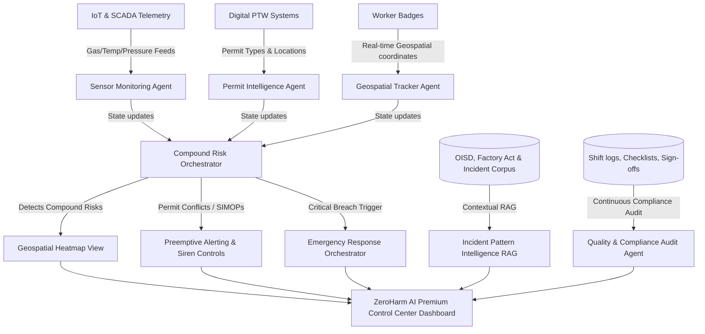
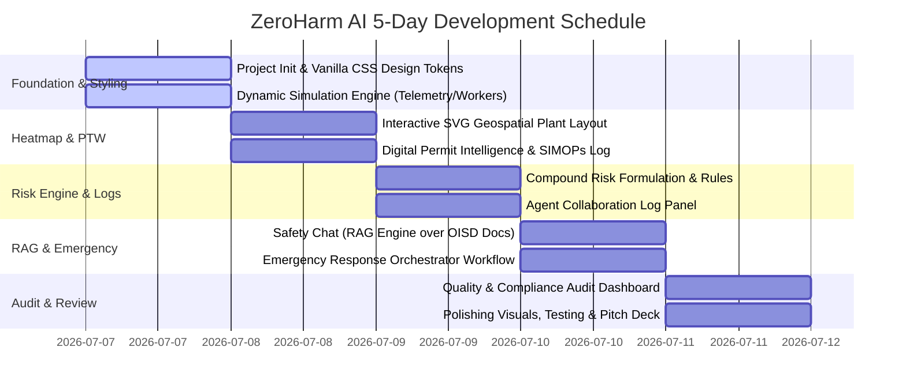

# 🛡️ ZeroHarm AI : AI-Powered Industrial Safety Intelligence for Zero-Harm Operations

[](#)
[](#)
[](#)
[](#)

ZeroHarm AI is a next-generation, AI-driven **Industrial Safety Intelligence (ISI) platform** designed to eliminate fatal workplace accidents in heavy industries (steel, chemical, mining, and manufacturing). By bridging the gap between isolated safety tools, ZeroHarm AI fuses real-time IoT sensor telemetry, digital Work Permits (PTW), worker geolocation, and regulatory compliance into a unified intelligence layer that predicts and prevents accidents before they occur.

---

## 📌 About the Project

### The Problem Context
India's heavy industrial sector continues to pay a devastating human cost. According to **DGFASLI**, over **6,500 fatal workplace accidents** were recorded in FY2023 alone (excluding most mining and construction sectors). In January 2025, eight workers tragically died at the Visakhapatnam Steel Plant when entrapped gases triggered a sudden explosion in the coke oven battery. This facility had fully functional gas detectors, permit-to-work protocols, and SCADA systems. However, warning signals existed on isolated dashboards and were **unacted upon** because there was no intelligence layer to correlate gas pressure sensor spikes with active hot-work permits in the vicinity. 

A **FICCI survey in 2024** revealed that **over 60% of large industrial facilities** rely on manual handoffs to coordinate between their own digital safety tools. The bottleneck is not a lack of safety systems; it is the **absence of a unified intelligence layer** that translates disjointed data points into preemptive, life-saving operational decisions.

### Our Solution
**ZeroHarm AI** addresses this critical vulnerability by acting as the plant's digital central nervous system. It continuously ingests streams from:
1. **IoT / SCADA Telemetry**: Gas concentrations (CO, CH4, O2), temperature, and pressure.
2. **Digital Permit to Work (PTW)**: Details, locations, and timings of active maintenance, hot work, and confined space entries.
3. **Geospatial Worker Badges**: Live locations of field workers and maintenance crews.
4. **Shift Logs & Historical Incident Files**: Regulatory standards (OISD, Factory Act) and past near-miss records.

By correlating these inputs, the platform's multi-agent risk engine detects **compound risk conditions**—such as active hot work permits in zones experiencing sub-critical gas accumulation—and triggers immediate emergency response protocols or automatic permit suspensions.

---

## 🏗️ System Architecture

ZeroHarm AI operates using a decentralized multi-agent system where specialized agents monitor individual safety vectors, collaborate to identify compound risks, and output real-time alerts.



---

## 🚀 Core Features

### 1. Compound Risk Detection Engine
Correlates disparate data points in real time to detect high-risk configurations that single-sensor baselines miss. 
* *Example:* It will not flag a 10ppm CO reading alone, nor an active hot work permit alone, but will immediately raise a **Critical Alert** if both occur in the same coke oven zone simultaneously.

### 2. Geospatial Safety Heatmap
An interactive, high-fidelity 2D plant layout SVG showing dynamic hazard indexes (Safe, Warning, Critical) across key plant structures, detailing active permits, active workers, and real-time gas/sensor overlays.

### 3. Digital Permit Intelligence Agent
Monitors active permits against live plant telemetry. Automatically identifies **Simultaneous Operations (SIMOPs)** conflicts (e.g., hot work authorized near active gas venting lines) and suggests permit suspensions.

### 4. Incident Pattern Intelligence (RAG Chat)
An interactive AI assistant pre-loaded with regulatory documentation (Factory Act 1948, OISD-137, OISD-105) and historical incident profiles. It allows safety officers to ask questions and receive structured guidance with direct regulatory citations.

### 5. Emergency Response Orchestrator
When a critical compound risk is triggered, this module handles the first 10 minutes of crisis: activates plant-wide alarms, displays an evacuation tracker, triggers shut-off valves, alerts first responders, and generates a preliminary regulatory incident report.

### 6. Quality & Compliance Audit Agent
Monitors shift changeovers, pre-work safety check logs, and training records. Calculates a real-time compliance score and automatically generates corrective actions for procedural deviations.

---

## 🧠 Backend Implementation & Directory Structure

ZeroHarm AI's backend is implemented in Python using FastAPI. It operates as a unified service that fuses Person A's risk detection rules and ML models, Person B's spatial heatmap computations and emergency response orchestrator, and Person C's compliance auditing and RAG safety agent.

### Detailed Directory Structure
```
📂 ET-Hackathon (Workspace Root)
 ├── 📄 ABOUT.md                     # Executive summary & judging criteria alignment
 ├── 📄 README.md                    # Core project documentation & setup instructions
 ├── 📄 ZeroHarm_AI_Team_Roles.docx  # Team structure and roles breakdown
 ├── 📂 backend
 │    ├── 📄 .env                    # Environment variables (OpenRouter key, active model)
 │    ├── 📄 requirements.txt        # Python dependency manifest
 │    ├── 📄 run.py                  # FastAPI server entrypoint (running uvicorn)
 │    ├── 📄 test_api.py             # Test Client A: Core Risk scoring & ML Anomaly patterns
 │    ├── 📄 test_api_b.py           # Test Client B: Spatial heatmap simulation & evacuations
 │    ├── 📄 test_api_c.py           # Test Client C: Incident RAG queries & compliance audits
 │    └── 📂 app
 │         ├── 📄 main.py            # Primary FastAPI server, endpoint routers, & websocket feeds
 │         ├── 📄 config.py          # Platform config values (zone definitions, simulator ticks)
 │         ├── 📂 engine             # Person A: Safety Rules Engine & ML Models
 │         │    ├── 📄 rules.py       # Factories Act & OISD guidelines evaluation logic
 │         │    ├── 📄 ml_anomaly.py   # Supervised Random Forest & Unsupervised Isolation Forest
 │         │    └── 📄 models.py       # Pydantic request/response schemas for risk engine
 │         ├── 📂 geospatial         # Person B: Spatial Telemetry & Simulator
 │         │    ├── 📄 plant_layout.py # Plant zone layouts & active structures
 │         │    ├── 📄 heatmap.py     # Hazard index calculations & zone risk scoring
 │         │    ├── 📄 worker_simulator.py # Simulated real-time worker movements
 │         │    └── 📄 models.py       # Geospatial data schemas
 │         ├── 📂 orchestrator       # Person B: Emergency Dispatch & Alerts
 │         │    ├── 📄 evacuation.py  # Evacuation routing, speed trackers, and headcounts
 │         │    ├── 📄 alert_channels.py # Alarm, SMS, and dashboard alert dispatching
 │         │    └── 📄 incident_report.py # Automated, compliant incident report generator
 │         └── 📂 rag                # Person C: Compliance RAG Agent
 │              ├── 📄 agent.py       # OpenRouter RAG analysis & fallback engine
 │              ├── 📄 vector_store.py # Local TF-IDF search index
 │              └── 📄 documents.py   # Statutory safety corpus & historical incident logs
```

### Module Descriptions
* [backend/app/main.py](file:///C:/Users/anish/OneDrive/College/Hackathon/ET-Hackathon/backend/app/main.py): Primary FastAPI server, state management, websockets, and simulation.
* [backend/app/engine/rules.py](file:///C:/Users/anish/OneDrive/College/Hackathon/ET-Hackathon/backend/app/engine/rules.py): Safety rules evaluation matching compliance standards.
* [backend/app/engine/ml_anomaly.py](file:///C:/Users/anish/OneDrive/College/Hackathon/ET-Hackathon/backend/app/engine/ml_anomaly.py): Isolation Forest and Random Forest anomaly scoring models.
* [backend/app/engine/models.py](file:///C:/Users/anish/OneDrive/College/Hackathon/ET-Hackathon/backend/app/engine/models.py): Pydantic input/output schemas for the risk scoring engine.
* [backend/app/rag/agent.py](file:///C:/Users/anish/OneDrive/College/Hackathon/ET-Hackathon/backend/app/rag/agent.py): RAG safety agent handling OpenRouter model inference and local rule fallback.
* [backend/app/rag/documents.py](file:///C:/Users/anish/OneDrive/College/Hackathon/ET-Hackathon/backend/app/rag/documents.py): Curated safety document corpus (OISD standards, Factories Act, incident history).

---

## 🛡️ ZeroHarm AI Backend Run & Test Guide

This guide outlines how to run, test, and validate the **ZeroHarm AI Industrial Safety Intelligence Platform** backend.

### 🚀 1. How to Run the Server

#### Prerequisites & Virtual Environment Setup
Ensure you have activated the virtual environment and have all dependencies installed.

**For PowerShell:**
```powershell
.\.venv\Scripts\Activate.ps1
```

**For CMD:**
```cmd
.venv\Scripts\activate.bat
```

#### Start the FastAPI Server
From the root workspace directory, run:
```bash
python backend/run.py
```
This launches the server at **`http://127.0.0.1:8000`** with auto-reload enabled.
* The interactive API docs (Swagger UI) will be accessible at: [http://localhost:8000/docs](http://localhost:8000/docs).

---

### 🧪 2. How to Run the Automated Tests

Open a new terminal (with the virtual environment activated) and run the three test scripts:

| Test Script | Target Module | Command |
| :--- | :--- | :--- |
| **Test Client A** | Compound Risk & ML Detection Engine | `python backend/test_api.py` |
| **Test Client B** | Geospatial Heatmap & Emergency Orchestrator | `python backend/test_api_b.py` |
| **Test Client C** | Incident RAG & Compliance Audit Agent | `python backend/test_api_c.py` |

---

### 📊 3. Scenario Inputs & Expected Outputs

Here are the precise inputs submitted to the backend and what the safety engine outputs for each scenario.

#### Scenario 1: Clean/Normal Operations
* **Zone**: `Blast Furnace A`
* **Telemetry**: Standard atmospheric readings (20.8% O2, low CO, 0% Methane).
* **Permits**: None.

##### Input Data (`POST /risk-score`)
```json
{
  "zone": "Blast Furnace A",
  "gas_readings": {
    "o2": 20.8,
    "co": 2.0,
    "ch4_lfl": 0.0,
    "h2s": 0.1,
    "temperature": 28.0,
    "pressure": 1.0
  },
  "permits": [],
  "maintenance_active": false,
  "shift_changeover_active": false,
  "timestamp": "2026-07-16T12:00:00Z"
}
```

##### Expected Output
```json
{
  "zone": "Blast Furnace A",
  "composite_risk_score": 6.0,
  "risk_level": "Safe",
  "rule_score": 5.0,
  "ml_score": 7.6,
  "action_required": "ROUTINE MONITORING - Standard operating procedures apply. No corrective action needed.",
  "suspend_permits": [],
  "factors": [
    {
      "name": "Normal Operations (Clean Telemetry)",
      "score": 5.0,
      "contribution": 100.0,
      "details": "No active hazardous permits, no maintenance, and all sensors reporting green."
    }
  ]
}
```

---

#### Scenario 2: Methane Leak during Hot Work (Explosion Hazard)
* **Zone**: `Coke Oven Battery 1`
* **Telemetry**: Methane is elevated at **6.8% LFL** (above the 4% safety limit for spark-producing work).
* **Permits**: Active hot work permit (`PTW-HW-202`).

##### Input Data (`POST /risk-score`)
```json
{
  "zone": "Coke Oven Battery 1",
  "gas_readings": {
    "o2": 20.8,
    "co": 5.0,
    "ch4_lfl": 6.8,
    "h2s": 0.1,
    "temperature": 32.5,
    "pressure": 1.02
  },
  "permits": [{
    "permit_id": "PTW-HW-202",
    "permit_type": "hot_work",
    "status": "active",
    "zone": "Coke Oven Battery 1",
    "workers_count": 3
  }],
  "maintenance_active": false,
  "shift_changeover_active": false,
  "timestamp": "2026-07-16T12:00:00Z"
}
```

##### Expected Output
```json
{
  "zone": "Coke Oven Battery 1",
  "composite_risk_score": 95.0,
  "risk_level": "Critical",
  "rule_score": 95.0,
  "ml_score": 64.7,
  "action_required": "EVACUATE AREA & HALT PERMITS - Composite risk score is critical. Safety sirens should be activated. Emergency Response Orchestrator must coordinate evacuation.",
  "suspend_permits": ["PTW-HW-202"],
  "factors": [
    {
      "name": "Explosion Hazard (CH4 Flammability)",
      "score": 34.4,
      "contribution": 26.6,
      "details": "FLAMMABLE GAS DETECTED: Methane level is 6.8% LFL (Lower Flammable Limit). Explosion risk elevated."
    },
    {
      "name": "Hot Work Flammable Gas Overlap",
      "score": 95.0,
      "contribution": 73.4,
      "details": "CRITICAL: Active Hot Work (ignition source) in area with 6.8% LFL Methane. High risk of immediate fire/explosion. Violation of OISD-STD-105 Work Permit standards."
    }
  ]
}
```

---

#### Scenario 3: Oxygen Depletion in Confined Space (Asphyxiation Hazard)
* **Zone**: `Sinter Plant`
* **Telemetry**: Oxygen dropped to **16.2%** (critical asphyxiation range < 19.5% per Factories Act Sec 36) and CO elevated to **28 ppm**.
* **Permits**: Confined space entry permit active (`PTW-CS-101`).

##### Input Data (`POST /risk-score`)
```json
{
  "zone": "Sinter Plant",
  "gas_readings": {
    "o2": 16.2,
    "co": 28.0,
    "ch4_lfl": 0.1,
    "h2s": 0.2,
    "temperature": 29.0,
    "pressure": 0.98
  },
  "permits": [{
    "permit_id": "PTW-CS-101",
    "permit_type": "confined_space",
    "status": "active",
    "zone": "Sinter Plant",
    "workers_count": 2
  }],
  "maintenance_active": false,
  "shift_changeover_active": false,
  "timestamp": "2026-07-16T12:00:00Z"
}
```

##### Expected Output
```json
{
  "zone": "Sinter Plant",
  "composite_risk_score": 92.0,
  "risk_level": "Critical",
  "rule_score": 92.0,
  "action_required": "EVACUATE AREA & HALT PERMITS - Composite risk score is critical. Safety sirens should be activated. Emergency Response Orchestrator must coordinate evacuation.",
  "suspend_permits": ["PTW-CS-101"],
  "factors": [
    {
      "name": "Asphyxiation Risk (Oxygen Deficiency)",
      "score": 89.5,
      "details": "ASPHYXIATION HAZARD: Oxygen level is critical at 16.2% (below 19.5% standard threshold, Factories Act Sec 36)."
    },
    {
      "name": "Confined Space Compound Risk",
      "score": 92.0,
      "details": "CRITICAL: Active Confined Space permit overlapping with abnormal gas readings. Poor ventilation in confined spaces creates lethal hazard traps (Factories Act 1948 Section 36 compliance breach)."
    }
  ]
}
```

---

#### Scenario 4: SIMOPs Permit Clash (Simultaneous Operations Conflict)
* **Zone**: `Coke Oven Battery 1`
* **Telemetry**: Clean gas readings.
* **Permits**: Both **Hot Work** and **Confined Space** entry are active in the same zone at the same time.

##### Input Data (`POST /risk-score`)
```json
{
  "zone": "Coke Oven Battery 1",
  "gas_readings": {
    "o2": 20.8,
    "co": 3.0,
    "ch4_lfl": 0.2,
    "h2s": 0.1,
    "temperature": 30.0,
    "pressure": 1.0
  },
  "permits": [
    { "permit_id": "PTW-HW-202", "permit_type": "hot_work", "status": "active", "zone": "Coke Oven Battery 1" },
    { "permit_id": "PTW-CS-303", "permit_type": "confined_space", "status": "active", "zone": "Coke Oven Battery 1" }
  ],
  "maintenance_active": false,
  "shift_changeover_active": false,
  "timestamp": "2026-07-16T12:00:00Z"
}
```

##### Expected Output
```json
{
  "zone": "Coke Oven Battery 1",
  "composite_risk_score": 80.0,
  "risk_level": "Critical",
  "factors": [
    {
      "name": "SIMOPs (Simultaneous Operations) Hazard",
      "score": 15.0,
      "details": "SIMOPs Conflict: Hot Work (ignition) and Confined Space (toxic hazard) active simultaneously..."
    }
  ]
}
```

---

#### Scenario 5: Historical & Statutory Query (RAG Agent)
* **Query**: `"Have we seen a Carbon Monoxide leak during shift changeover before?"`

##### Input Data (`POST /api/rag/query`)
```json
{
  "query": "Have we seen a Carbon Monoxide leak during shift changeover before?"
}
```

##### Expected Output
* **Mode**: `"OpenRouter (openrouter/free) (Active)"` (or `"Rule-Based Engine (Demo Fallback)"` if offline)
* **Sources**: Lists matches like `Historical Incident: Coke Oven CO Poisoning Case (April 2025)`.
* **Answer**: Returns a markdown response highlighting the April 2025 Coke Oven accident where a shift handover overlap with maintenance caused a toxic CO leak (85 ppm), violating the Factories Act Section 36.

---

#### Scenario 6: Compliance Audit
* **Zone**: `Sinter Plant`
* **Telemetry**: low oxygen (16.5% O2) & active confined space permit.

##### Input Data (`POST /api/compliance/audit`)
```json
{
  "zone": "Sinter Plant",
  "telemetry": {
    "o2": 16.5,
    "co": 35.0,
    "ch4_lfl": 0.1,
    "h2s": 0.2
  },
  "permits": [
    { "permit_id": "PTW-CS-101", "permit_type": "confined_space", "status": "active" }
  ],
  "maintenance_active": true,
  "shift_changeover_active": false
}
```

##### Expected Output
* A detailed audit report highlighting compliance gaps:
  - ❌ **Factories Act 1948 - Section 36 Deviation**: Confined space atmosphere is deficient in oxygen (< 19.5%).
  - ❌ **OISD-GDN-137 Gas Alarm Deviation**: Carbon Monoxide limits exceeded (> 25 ppm).
  - **Recommendations**: Immediate ventilation, permit suspension, and standby rescue monitors.

---

## 🛠️ Tech Stack

* **Frontend**: React (Vite), JavaScript (ES6+)
* **Styling**: Vanilla CSS (Custom properties, grid systems, glassmorphism, responsive grids, and neon-alert glow variables)
* **Visualization**: Interactive SVG layouts, Recharts for sensor history graphs
* **Agent Simulation**: Stateful react-context engine simulating collaborative multi-agent decisions (debates, telemetry, location movements)
* **Icons**: `lucide-react`

---

## 📅 5-Day Implementation Timeline



---

## 🏷️ Tags

`#IndustrialSafety` `#AIAgents` `#GeospatialAnalytics` `#MultiAgentSystems` `#ZeroHarmAI` `#RAG` `#RiskIntelligence` `#FactoriesAct` `#OISD` `#SCADA`
