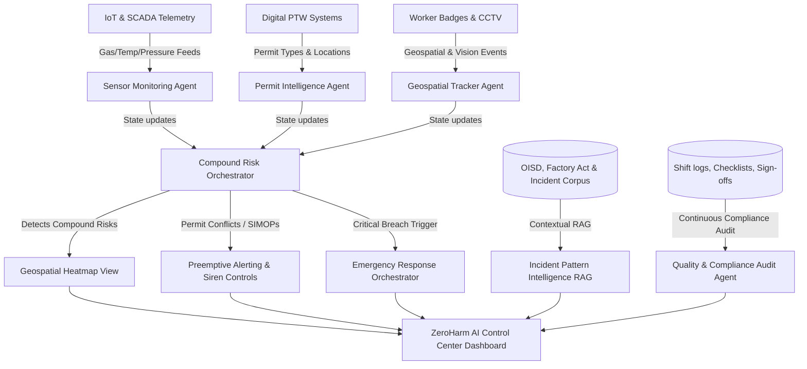

# 🛡️ ZeroHarm AI: AI-Powered Industrial Safety Intelligence for Zero-Harm Operations

[](#)
[](#)
[](#)
[](#)

`#IndustrialSafety` `#AIAgents` `#GeospatialAnalytics` `#MultiAgentSystems` `#ZeroHarmAI` `#RAG` `#RiskIntelligence` `#FactoriesAct` `#OISD` `#SCADA` `#ComputerVision` `#ProcessGraphs`

ZeroHarm AI is a next-generation, AI-driven **Industrial Safety Intelligence (ISI) platform** designed to eliminate fatal workplace accidents in heavy industries (steel, chemical, mining, and manufacturing). By bridging the gap between isolated safety tools, ZeroHarm AI fuses real-time IoT sensor telemetry, digital Work Permits (PTW), worker geolocation, CCTV computer vision alerts, plant topology, and regulatory compliance into a unified intelligence layer that predicts and prevents accidents before they occur.

---

## 👥 Collaborators

- [Parinamika-13](https://github.com/Parinamika-13)
- [SSJ-08](https://github.com/SSJ-08)
- [vahinichilukamarri](https://github.com/vahinichilukamarri)
- [AnishaPaturi](https://github.com/AnishaPaturi)

---

## 🛠️ Tech Stack & Technologies Used

ZeroHarm AI leverages a modern, robust, and highly integrated technology stack across the frontend user experience and the backend safety intelligence engine:

### 💻 Frontend (User Interface)
* **Core Framework**: **React 19** & **Next.js 16 (App Router)** for fast, optimized page compilation and server-side rendering support.
* **State Management**: **Zustand** for lightweight, high-performance global state management across live SCADA telemetry, alerts, and authentication.
* **Styling & Layout**: **Tailwind CSS** combined with custom **Vanilla CSS variables** for deep glassmorphism themes, glowing safety states, responsive charts, and printer-friendly PDF compliance layouts.
* **Micro-Animations**: **Framer Motion** for smooth transition physics, fading alerts, dynamic progress bars, and modal slides.
* **Data Visualization**: **Recharts** to compile and render live, high-frequency historical sensor graphs (oxygen depletion, carbon monoxide accumulation, gas LPG and ambient pressure trends).
* **Iconography**: **Lucide React** for modern, high-contrast dashboard iconography.

### ⚙️ Backend (Safety Intelligence Engine)
* **API Framework**: **FastAPI (Python 3.11+)** for high-performance, asynchronous REST API routes and low-latency bidirectional WebSockets streaming live telemetry.
* **Artificial Intelligence**:
  * **OpenRouter API** integration linking safety reasoning models for collaborative agent debates, regulatory citations, and advisory compilation.
  * **Dynamic TF-IDF Vector Store** (In-Memory) for fast semantic RAG query calculations across indexed Factories Act and OISD safety standard databases.
* **Machine Learning & Analytics**:
  * **Scikit-Learn** implementing supervised **Random Forest Classifier** models for multi-sensor threat classification.
  * **Isolation Forest Classifier** for unsupervised anomaly detection and scoring on raw SCADA feeds.
* **Geospatial & Adjacency Graphs**:
  * **NetworkX** to build process piping topology graphs, calculating cascading risk propagation between boilers, headers, and valve segments.
* **Simulation Engine**: Custom background python thread loops to simulate realistic sensor drifts, gas anomalies, and worker badge GPS coordinate trails.

### 🐳 Infrastructure & Deployment
* **Containerization**: **Docker** & **Docker Compose** to package the frontend and backend microservices for uniform staging.
* **Serialization**: **Joblib/Pickle** for automated disk serialization of trained ML anomaly scoring model weights, avoiding initialization delays during reboots.
* **Testing & Diagnostics**: Automated REST client suites (`requests` & `pytest`) validating SCADA rules, rate-of-change temporal equations, black box logs, and permit logic.

---

## 📌 About the Project

### The Problem Context
India's heavy industrial sector continues to pay a devastating human cost. According to **DGFASLI**, over **6,500 fatal workplace accidents** were recorded in FY2023 alone (excluding most mining and construction sectors). In January 2025, eight workers tragically died at the Visakhapatnam Steel Plant when entrapped gases triggered a sudden explosion in the coke oven battery. This facility had fully functional gas detectors, permit-to-work protocols, and SCADA systems. However, warning signals existed on isolated dashboards and were **unacted upon** because there was no intelligence layer to correlate gas pressure sensor spikes with active hot-work permits in the vicinity. 

A **FICCI survey in 2024** revealed that **over 60% of large industrial facilities** rely on manual handoffs to coordinate between their own digital safety tools. The bottleneck is not a lack of safety systems; it is the **absence of a unified intelligence layer** that translates disjointed data points into preemptive, life-saving operational decisions.

### Our Solution
**ZeroHarm AI** addresses this critical vulnerability by acting as the plant's digital central nervous system. It continuously ingests streams from:
1. **IoT / SCADA Telemetry**: Gas concentrations (CO, CH4, O2), temperature, and pressure.
2. **Digital Permit to Work (PTW)**: Details, locations, and timings of active maintenance, hot work, and confined space entries.
3. **Geospatial Worker Badges**: Live locations of field workers and maintenance crews.
4. **CCTV Frame Analytics & Visual Anomaly Detection**: Ingests CCTV analytics event metadata (PPE violations, smoke, unauthorized zone entry) and analyzes uploaded keyframe snapshots using a pixel-level heuristic engine. Detects camera occlusion (lens obstruction), thermal flare signatures via redness ratio indexing, and nominal/healthy frame states. Escalates local hazard indices instantly when visual anomalies correlate with sensor or permit data.
5. **Shift Logs & Historical Incident Files**: Regulatory standards (OISD, Factory Act) and past near-miss records.

By correlating these inputs, the platform's multi-agent risk engine detects **compound risk conditions**—such as active hot work permits in zones experiencing sub-critical gas accumulation—and triggers immediate emergency response protocols or automatic permit suspensions.

---

## 🏗️ System Architecture

ZeroHarm AI operates using a decentralized multi-agent system where specialized agents monitor individual safety vectors, collaborate to identify compound risks, and output real-time alerts.



---

## 🚀 Core & Advanced Features

### 1. Compound Risk Detection Engine
Correlates disparate data points in real time to detect high-risk configurations that single-sensor baselines miss. 
* *Example:* It will not flag a 10ppm CO reading alone, nor an active hot work permit alone, but will immediately raise a **Critical Alert** if both occur in the same coke oven zone simultaneously.

### 2. Geospatial Safety Heatmap
An interactive, high-fidelity 2D plant layout SVG showing dynamic hazard indexes (Safe, Warning, Critical) across key plant structures, detailing active permits, active workers, and real-time gas/sensor overlays.

### 3. Digital Permit Intelligence Agent
Monitors active permits against live plant telemetry. Automatically identifies **Simultaneous Operations (SIMOPs)** conflicts (e.g., hot work authorized near active gas venting lines) and suggests permit suspensions.

### 4. Incident Pattern Intelligence (RAG Chat)
An interactive AI assistant pre-loaded with regulatory documentation (Factory Act 1948, OISD-137, OISD-105) and historical incident profiles. It allows safety officers to ask questions and receive structured guidance with direct regulatory citations.

### 5. Emergency Response Orchestrator
When a critical compound risk is triggered, this module handles the first 10 minutes of crisis: activates plant-wide alarms, displays an evacuation tracker, triggers shut-off valves, alerts first responders, and generates a preliminary regulatory incident report.

### 6. Quality & Compliance Audit Agent
Monitors shift changeovers, pre-work safety check logs, and training records. Calculates a real-time compliance score and automatically generates corrective actions for procedural deviations.

### 7. CCTV Frame Analytics & Visual Anomaly Detection
Ingests CCTV analytics event metadata from camera streams (PPE violations, smoke/sparks, unauthorized entry) and analyzes uploaded keyframe snapshots through a pixel-level heuristic engine. The frame analyzer computes luminance, contrast standard deviation, and thermal redness indexing to detect camera occlusion (lens obstruction), flame/thermal flare signatures, and nominal frame states. Detected visual anomalies are fused directly into the compound risk scoring pipeline alongside gas telemetry and permit intelligence.

### 8. Plant Process Graph & Topology Cascading Risk
Uses a directed in-memory process graph (`networkx`) representing pipelines, valves, vents, and units to trace and propagate cascading hazards. Instead of calculating spherical buffers, it models how toxic leaks or fire spreads through process connections.

### 9. Temporal Rate-of-Change Tracking
Maintains a rolling historical buffer of sensor readings to compute the velocity and acceleration of gas accumulation (e.g., $d[CO]/dt$). This allows the platform to raise early warnings before static thresholds are officially breached.

### 10. Actionable Compliance & Safety Workflows (Ticketing)
Translates audit gaps and incident findings into trackable safety tickets assigned to specific roles (e.g., "Maintenance Engineer"). Safety officers can update, audit, and sign off on tasks to close the safety loop.

### 11. Black Box Evidence Preservation ("Flight Data Recorder")
Upon a critical incident trigger, the system automatically captures and seals the preceding 10 minutes of raw telemetry, active permits, worker tracks, and agent deliberations. This is written into a read-only JSON archive file under `backend/data/evidence/` to prevent tampering.

### 12. Dynamic RAG Document Ingestion & Upload
Enables safety teams to upload new regulatory policies, shift logs, or standard operating procedures directly into the RAG vector search index. Uploaded files are dynamically parsed, chunked, and vectorized on the fly.

### 13. Serialized ML Model Persistence
Maintains supervised Random Forest and unsupervised Isolation Forest anomaly scoring models. Features automated pickle/joblib serialization to disk, preventing delays and retrains during server reboot cycles.

### 14. Gatehouse Onboarding System (Tiered Trust Model)
Enforces a secure, multi-stage trust clearance system for safety personnel in compliance with Factories Act Sec. 87. Prevents public domain signups (gmail/yahoo/etc.), collects statutory safety certificates, and routes registration requests to a "pending sponsorship" queue visible to verified plant administrators.

---

## 💡 Fully Implemented Innovations (20x Safety AI Features)

ZeroHarm AI implements a comprehensive suite of 20 high-impact safety innovations designed for modern, high-hazard industrial environments:

### 1. 🤝 Multi-Agent Collaborative Reasoning (Most Important)
Multiple specialized AI agents reason and debate in a structured dialogue to calculate compound risks before raising an alarm, rather than relying on basic single-sensor thresholds (e.g., Gas rising + Active Maintenance + Confined Space + Poor ventilation = 96% risk of explosion in 18 mins).
* **Implementation:** [collaborative_reasoning.py](file:backend/app/engine/collaborative_reasoning.py) | [page.tsx (Dashboard Discussion Feed)](file:frontend/app/dashboard/page.tsx)

### 2. ⏳ Predictive Timeline Simulation
Like Google Maps predicts traffic, ZeroHarm AI projects chronological event chains and estimated time-to-incident if current telemetry trends continue unchecked without intervention.
* **Implementation:** [predictive_timeline.py](file:backend/app/engine/predictive_timeline.py) | [page.tsx (Predictive Timeline Panel)](file:frontend/app/dashboard/page.tsx)

### 3. 🌐 Industrial Digital Twin
A live, dynamic 2D plant visualization featuring real-time zone color gradients (Green &rarr; Yellow &rarr; Orange &rarr; Red), moving gas dispersion clouds, simulated worker coordinate tracking trails, exit blockages, and visual overheating alarms.
* **Implementation:** [heatmap.py](file:backend/app/geospatial/heatmap.py) | [page.tsx (Digital Twin Canvas)](file:frontend/app/digital-twin/page.tsx)

### 4. 🧠 Explainable AI Risk Reasoning
Breaks down the final risk index into transparent, human-readable safety factors with individual risk contributions and confidence levels, making AI predictions audit-friendly.
* **Implementation:** [rules.py](file:backend/app/engine/rules.py) | [page.tsx (Near-Miss Breakdown)](file:frontend/app/near-misses/page.tsx)

### 5. ⚠️ Near Miss Prediction
Proactively forecasts high-probability incident patterns (e.g. tracking workers entering restricted zones repeatedly over several shifts with zero immediate incidents today but escalating risk tomorrow).
* **Implementation:** [near_miss_predictor.py](file:backend/app/engine/near_miss_predictor.py) | [page.tsx (Near-Miss Console)](file:frontend/app/near-misses/page.tsx)

### 6. 👟 AI Safety Coach
Monitors individual worker safety scores, tracking PPE violations, unauthorized zone entry counts, ignored alerts, and fatigue to suggest mandatory training and supervisors.
* **Implementation:** [safety_coach.py](file:backend/app/engine/safety_coach.py) | [page.tsx (Safety Coach Profiles)](file:frontend/app/safety-coach/page.tsx)

### 7. 🕸️ Dynamic Risk Graph (Knowledge Graph)
Uses an in-memory process topology mapping relationships between workers, permits, zones, sensors, machines, and historical incident logs to propagate hazard levels.
* **Implementation:** [graph.py](file:backend/app/knowledge_graph/graph.py) | [page.tsx (Risk Graph View)](file:frontend/app/knowledge-graph/page.tsx)

### 8. 🔍 AI Root Cause Generator
Automatically constructs post-incident/near-miss analysis specifying primary cause, contributing human factors, corrective actions, and violated regulatory acts (e.g. Factory Act Sec 36 or OISD-STD-105).
* **Implementation:** [incident_report.py](file:backend/app/orchestrator/incident_report.py) | [page.tsx (Incident desk Diagnostics)](file:frontend/app/incidents/page.tsx)

### 9. 📈 Risk Propagation Engine
Models process network connections (piping systems, isolation valves, boilers) to calculate cascading hazard escalation (e.g. valve failure upstream causing pressure spikes and boiler shutdown downstream).
* **Implementation:** [topology.py](file:backend/app/geospatial/topology.py) | [test_topology.py](file:backend/test_topology.py)

### 10. 💤 Fatigue Detection
Integrates CCTV telemetry indicators, shift lengths, and night-shift timing multipliers to predict operational worker exhaustion and suggest immediate rest schedules.
* **Implementation:** [safety_coach.py](file:backend/app/engine/safety_coach.py) | [page.tsx (Safety Coach Profile Metrics)](file:frontend/app/safety-coach/page.tsx)

### 11. 📝 AI Shift Handover Summary
Compiles all isolated machinery, telemetry alerts, active permits, and high-risk zones into a concise compliance handover checklist for incoming shifts.
* **Implementation:** [handover.py](file:backend/app/orchestrator/handover.py) | [page.tsx (Handover Summary Report)](file:frontend/app/handover/page.tsx)

### 12. 👮 Regulatory Copilot
A conversational assistant that indexes safety standards (OISD, Factories Act 1948) to answer regulatory compliance questions such as: "Can hot work happen here?"
* **Implementation:** [agent.py (RAG Agent)](file:backend/app/rag/agent.py) | [page.tsx (RAG Chatbot)](file:frontend/app/chatbot/page.tsx)

### 13. 🚨 Autonomous Emergency Commander
Automatically coordinates initial containment: shuts downstream fuel valves, halts permits, engages ventilation systems, sounds sirens, plans evacuation paths, and generates incident logs.
* **Implementation:** [evacuation.py](file:backend/app/orchestrator/evacuation.py) | [main.py (FastAPI entrypoint)](file:backend/app/main.py)

### 14. 🗺️ Spatial AI
Maintains spatial location maps, identifying overlapping hazard parameters (e.g. worker standing 3m from gas leak, 8m from hot welding spark).
* **Implementation:** [heatmap.py](file:backend/app/geospatial/heatmap.py) | [agent.py (Permit boundary audit)](file:backend/app/permits/agent.py)

### 15. 💾 Learning Risk Memory
Correlates ambient factors (shift restarts, Friday rushes, storm stagnation, summer spikes) to adjust plant risk scoring dynamically based on historical precedent patterns.
* **Implementation:** [learning_risk_memory.py](file:backend/app/engine/learning_risk_memory.py) | [rules.py (Dynamic offset calculations)](file:backend/app/engine/rules.py)

### 16. 🛸 Autonomous Drone Inspection
Simulates dispatching autonomous quadcopters to inspect warning zones, returning live feeds, battery status, gas sniffing outputs, worker counts, and thermal sensor payloads.
* **Implementation:** [drone.py](file:backend/app/orchestrator/drone.py) | [page.tsx (Digital Twin sidebar control)](file:frontend/app/digital-twin/page.tsx)

### 17. 💬 Natural Language Query Engine
Lets safety officers query in plain English (e.g., "Show me all permits with gas > 20ppm during maintenance in the last 6 months") to return visual stats and highlighted layout zones.
* **Implementation:** [query_engine.py](file:backend/app/orchestrator/query_engine.py) | [page.tsx (Query engine integration)](file:frontend/app/chatbot/page.tsx)

### 18. 🧬 Risk Memory using RAG + Knowledge Graph
Fuses semantic documentation indexing (RAG) with process relation traversals (Knowledge Graph) to compute detailed Equipment, Weather, Maintenance, and Root Cause similarity matrices.
* **Implementation:** [hybrid_reasoner.py](file:backend/app/rag/hybrid_reasoner.py) | [page.tsx (Incident Desk diagnostics)](file:frontend/app/incidents/page.tsx)

### 19. 🤖 Plant Safety GPT
Enables step-by-step query checking before approving hazardous work permits, auditing active zone gas concentrations, LOTO isolations, and technician certifications.
* **Implementation:** [agent.py (RAG compliance audit)](file:backend/app/rag/agent.py) | [agent.py (Permit auditor)](file:backend/app/permits/agent.py)

### 20. 🔄 Self-Improving AI Agents
Implements an interactive feedback system where safety coordinators score agent decisions, dynamically updating weights to reinforce consensus predictions over time.
* **Implementation:** [feedback_engine.py](file:backend/app/engine/feedback_engine.py) | [collaborative_reasoning.py](file:backend/app/engine/collaborative_reasoning.py)

---

## 🔄 Recent Enhancements & Robustness Features

We have recently implemented a series of critical safety operations, backend persistence APIs, and frontend robustness upgrades:

### 1. Unified Backend Persistence for Manual Incident Logging
* **Server-Side Storage**: Added `POST /api/incidents` and `POST /api/incidents/resolve` endpoints to the FastAPI entrypoint ([main.py](file:///C:/Users/anish/OneDrive/College/Hackathon/ET-Hackathon/backend/app/main.py#L740-L790)). These endpoints persist manually reported incident files and resolution states in the server-side memory list `reports_list`.
* **State Synchronization**: Re-engineered the frontend `addIncident` and `updateIncident` store actions ([useIncident.ts](file:///C:/Users/anish/OneDrive/College/Hackathon/ET-Hackathon/frontend/hooks/useIncident.ts#L295-L330)) and incidents page ([page.tsx](file:///C:/Users/anish/OneDrive/College/Hackathon/ET-Hackathon/frontend/app/incidents/page.tsx)) to write to `localStorage` and synchronize with the backend APIs. This prevents the 5-second background SCADA sync loop (`syncIncidents()`) from overwriting manually reported/resolved incident logs.

### 2. Operational Dispatch Integration (Agent Debate Section)
* **Directives Dispatch**: Integrated the **DISPATCH** action in the dashboard's Agent Debate modal ([dashboard/page.tsx](file:///C:/Users/anish/OneDrive/College/Hackathon/ET-Hackathon/frontend/app/dashboard/page.tsx#L181-L235)). Dispatched recommendations dynamically trigger:
  * **Emergency Evacuations**: Declares a plant-wide emergency, flashes alarms, and sets the store's evacuation mode.
  * **Permit Revocations**: Automatically extracts permit IDs (e.g., `PTW-HW-202`) and revokes them via the event bus.
  * **ESD Process Valve Isolation**: Shuts down process boundaries by emitting an equipment fault telemetry alert.
  * **Rescue Crew Dispatch**: Logs a crew dispatch event to the SCADA telemetry terminal.
  * **Autonomous Drone Sweeps**: POSTs to `/api/drone/dispatch` on the backend to launch the quadcopter sweep.

### 3. Client-Side RAG & Precedent Fallback (Offline Mode)
* **Offline Analysis**: Added catch-and-fallback logic to the RAG analysis actions ([useIncident.ts](file:///C:/Users/anish/OneDrive/College/Hackathon/ET-Hackathon/frontend/hooks/useIncident.ts#L409-L425)) and incident diagnostics ([analysis/page.tsx](file:///C:/Users/anish/OneDrive/College/Hackathon/ET-Hackathon/frontend/app/analysis/page.tsx#L45-L60)). When the safety server is offline, the pages warn the console, notify via warning toasts, and load comprehensive local RAG assessments and similarity matrices.
* **Markdown Renderer**: Created a custom React [MarkdownRenderer](file:///C:/Users/anish/OneDrive/College/Hackathon/ET-Hackathon/frontend/component/MarkdownRenderer.tsx) to parse and render RAG reports as styled HTML elements (headers, lists, tables, checklists, blockquotes, bold/code inline text) rather than raw monospaced code. Removed all unnecessary symbols/emojis from safety summaries.

### 4. Compliant Handover Export & PDF Compilation
* **Re-run Loading Overlay**: Added local loading indicators and glassmorphism blurs to handover panels during report re-compilation, locking inputs to prevent click-spamming.
* **Print compilation**: Configured **Export Logbook** in [handover/page.tsx](file:///C:/Users/anish/OneDrive/College/Hackathon/ET-Hackathon/frontend/app/handover/page.tsx#L529-L531) to compile active permits, isolations, gas logs, risk zones, and AI summaries into a structured HTML print document, appending official shift change signature lines before triggering `window.print()`.

### 5. Plant Operations Simplification
* Removed Plant B and Plant C tabs, hooks, and switcher panels from the dashboard, focusing the dashboard exclusively on Plant A's real-time SCADA telemetry.

---

## 📂 Complete Workspace Folder Structure

Below is the complete file and directory layout of the ZeroHarm AI project workspace:

```
📂 ET-Hackathon (Workspace Root)
 ├── 📄 ABOUT.md                       # Executive summary & judging criteria alignment
 ├── 📄 README.md                      # Core project documentation & setup instructions
 ├── 📄 gap.md                         # Product gap analysis & engineering suggestions
 ├── 📄 backend_testing_methodologies.md # Detailed testing guidelines for backend APIs
 ├── 📄 openapi_testing_guide.md       # Guide for testing with OpenAPI specs
 ├── 📄 logo.png                       # ZeroHarm AI logo image
 ├── 📄 package.json                   # Root package configuration for Next.js app
 ├── 📄 package-lock.json              # NPM package lock
 ├── 📂 backend                        # FastAPI backend application
 │    ├── 📄 .env                      # Environment configurations (API keys, ports)
 │    ├── 📄 requirements.txt          # Python dependency manifest
 │    ├── 📄 run.py                    # Server startup script
 │    ├── 📄 run_all_tests.py          # Unified test execution suite
 │    ├── 📄 test_api.py               # Test Client A: Core Risk rules & ML anomaly models
 │    ├── 📄 test_api_b.py             # Test Client B: Heatmap & evacuations
 │    ├── 📄 test_api_c.py             # Test Client C: RAG & compliance audits
 │    ├── 📄 test_api_d.py             # Test Client D: Permit intelligence & integration assessments
 │    ├── 📄 test_cctv.py              # Test: Computer Vision alerts & PPE violations
 │    ├── 📄 test_temporal.py          # Test: Temporal telemetry trends (rate of change)
 │    ├── 📄 test_topology.py          # Test: Process network topology risk propagation
 │    ├── 📄 test_blackbox.py          # Test: Black box flight data logging verification
 │    ├── 📂 data
 │    │    └── 📂 evidence             # Incident telemetry archive (tamper-proof black box blocks)
 │    └── 📂 app
 │         ├── 📄 __init__.py
 │         ├── 📄 config.py            # Global configuration (zones, thresholds)
 │         ├── 📄 main.py              # FastAPI application server entrypoint
 │         ├── 📂 engine               # Person A: Safety Rules Engine & ML Models
 │         │    ├── 📄 ml_anomaly.py   # Isolation Forest and Random Forest classifiers
 │         │    ├── 📄 models.py       # Risk scoring data structures (Pydantic schemas)
 │         │    ├── 📄 rules.py        # Statutory safety rule calculations (OISD, Factories Act)
 │         │    ├── 📄 if_model.pkl    # Serialized Isolation Forest model
 │         │    └── 📄 rf_model.pkl    # Serialized Random Forest model
 │         ├── 📂 geospatial           # Person B: Plant Layout & Spatial Computation
 │         │    ├── 📄 heatmap.py      # Spatial risk computation & hazard mapping
 │         │    ├── 📄 models.py       # Geolocation Pydantic schemas
 │         │    ├── 📄 plant_layout.py # 2D plant coordinates config
 │         │    ├── 📄 topology.py     # Process Graph (cascading risk propagation)
 │         │    └── 📄 worker_simulator.py # Live worker coordinate simulator
 │         ├── 📂 orchestrator         # Person B: Emergency Dispatch & Actions
 │         │    ├── 📄 alert_channels.py # Dispatch alerts to dashboards, sirens, SMS
 │         │    ├── 📄 evacuation.py   # Safe exit route calculations, speed tracking
 │         │    ├── 📄 incident_report.py # Automated regulatory incident report builder
 │         │    └── 📄 workflow.py     # Actionable safety task workflows (ticketing system)
 │         ├── 📂 permits              # Person D: Digital Permit Intelligence Agent
 │         │    ├── 📄 agent.py        # Permit intelligence compliance checks
 │         │    ├── 📄 models.py       # Permit schema definitions
 │         │    └── 📄 rules.py        # Permit conflict checks (SIMOPs detection)
 │         ├── 📂 rag                  # Person C: Incident RAG Agent
 │         │    ├── 📄 agent.py        # LLM integration (OpenRouter) & local fallback
 │         │    ├── 📄 documents.py    # Statutory reference manuals & incident logs database
 │         │    └── 📄 vector_store.py # Local search index (TF-IDF and dynamic document indexer)
 │         └── 📂 integration          # Person D: Core Integration Pipeline
 │              ├── 📄 demo_script.py  # Simulation walk-through demo script
 │              ├── 📄 models.py       # Unified assessment schemas
 │              └── 📄 pipeline.py     # Multi-agent orchestrator aggregating Person A/B/C/D states
 └── 📂 frontend                       # Next.js UI Dashboard
      ├── 📄 package.json              # Frontend package script configurations
      ├── 📄 package-lock.json         # Frontend package locks
      ├── 📄 next.config.ts            # Next.js configurations
      ├── 📄 postcss.config.js         # CSS compiler settings
      ├── 📄 tailwind.config.ts        # UI component themes & color layouts
      ├── 📄 tsconfig.json             # Typescript configurations
      ├── 📂 public                    # Static media files & logo graphic assets
      ├── 📂 styles
      │    └── 📄 globals.css          # CSS styles & glassmorphism/glow custom variables
      ├── 📂 types
      │    ├── 📄 analytics.ts         # Chart data type definitions
      │    ├── 📄 incident.ts          # Incident report type structures
      │    └── 📄 user.ts              # Authorization type structures
      ├── 📂 hooks
      │    ├── 📄 useAuth.ts           # Login verification & cookie session manager
      │    ├── 📄 useIncident.ts       # Query and submit incidents & workflows
      │    └── 📄 useNotifications.ts  # WebSockets state notifications hook
      ├── 📂 services
      │    ├── 📄 api.ts               # Axios interceptors config
      │    ├── 📄 agents.ts            # Fetches agent state
      │    ├── 📄 analytics.ts         # Handles chart data requests
      │    ├── 📄 auth.ts              # Connects authorization APIs
      │    ├── 📄 chatbot.ts           # Handles RAG assistant queries
      │    ├── 📄 decisionEngine.ts    # Risk evaluation & ML endpoint calls
      │    ├── 📄 incident.ts          # Retrieves and updates incidents & tickets
      │    └── 📄 scenarioEngine.ts    # Control simulator triggers
      ├── 📂 component
      │    ├── 📄 AIChat.tsx           # RAG chatbot prompt input interface
      │    ├── 📄 AIResultCard.tsx     # Chat output container displaying source citations
      │    ├── 📄 AnalyticsChart.tsx   # Visualizes sensor trends with threshold limits
      │    ├── 📄 Button.tsx           # Custom styled buttons
      │    ├── 📄 ComplianceCard.tsx   # Displays audit violations with rule citations
      │    ├── 📄 DashboardCard.tsx    # Unified card container
      │    ├── 📄 Footer.tsx           # Dashboard footer bar
      │    ├── 📄 IncidentForm.tsx     # Custom permit requests & manual reporting console
      │    ├── 📄 IncidentTable.tsx    # List of generated incidents & black box downloads
      │    ├── 📄 Loader.tsx           # Animated page loaders & loaders
      │    ├── 📄 Modal.tsx            # Overlay popups
      │    ├── 📄 Navbar.tsx           # Navigation bar with active alarm sirens
      │    ├── 📄 NotificationPanel.tsx # Notifications dropdown showing active alerts
      │    ├── 📄 RiskGauge.tsx        # Gauge dial visualizing composite risk score
      │    ├── 📄 ScenarioConsole.tsx  # Dynamic dashboard console to trigger simulator ticks
      │    ├── 📄 Sidebar.tsx          # Sidebar menu
      │    ├── 📄 StatCard.tsx         # Real-time indicators of single sensors (green/amber/red)
      │    ├── 📄 Timeline.tsx         # Evacuation path steps
      │    └── 📄 UploadBox.tsx        # File drag-and-drop document upload block
      └── 📂 app
           ├── 📄 layout.tsx           # Next.js global layout & styling setup
           ├── 📄 page.tsx             # Landing overview page
           ├── 📄 not-found.tsx        # Standard 404 page
           ├── 📂 login
           │    └── 📄 page.tsx        # Sign-in portal page
           ├── 📂 signup
           │    └── 📄 page.tsx        # Multi-step safety officer onboarding request wizard
           ├── 📂 admin
           │    └── 📄 page.tsx        # Gatehouse onboarding & sponsorship approval queue
           ├── 📂 dashboard
           │    └── 📄 page.tsx        # Core control center dashboard
           ├── 📂 analysis
           │    └── 📄 page.tsx        # Detailed risk indicators & ML scoring
           ├── 📂 analytics
           │    └── 📄 page.tsx        # Time-series telemetry tracking dashboard
           ├── 📂 chatbot
           │    └── 📄 page.tsx        # Incident Pattern Intelligence chat portal
           ├── 📂 compliance
           │    └── 📄 page.tsx        # Real-time OISD/Factories Act compliance audit console
           ├── 📂 incidents
           │    └── 📄 page.tsx        # Incident logger page with flight recorder exports
           ├── 📂 reports
           │    └── 📄 page.tsx        # Regulatory report compiler
           ├── 📂 settings
           │    └── 📄 page.tsx        # Camera config, simulated ticks, & model configuration
           └── 📂 profile
                └── 📄 page.tsx        # Operational profile page
```

---

## 🛠️ Code Reference Links

Easily navigate to key implementation files in the project workspace:
* Rules Engine Evaluator: [backend/app/engine/rules.py]
* Process Topology Cascading Logic: [backend/app/geospatial/topology.py]
* ML Anomaly Detection Model: [backend/app/engine/ml_anomaly.py]
* RAG Search Agent: [backend/app/rag/agent.py]
* Permit Intelligence Agent: [backend/app/permits/agent.py]
* Integration Orchestrator Pipeline: [backend/app/integration/pipeline.py]
* Actionable Ticket Workflows: [backend/app/orchestrator/workflow.py]

---

## 🛡️ ZeroHarm AI Execution Guide

### 📦 1. Installation of Dependencies

ZeroHarm AI uses Next.js for the frontend and Python FastAPI for the backend. A virtual environment `.venv` is configured in the workspace root.

Ensure your Python virtual environment is activated and dependencies are installed.

**For PowerShell:**
```powershell
.\.venv\Scripts\Activate.ps1
```

**For CMD:**
```cmd
.venv\Scripts\activate.bat
```

Install both frontend and backend dependencies in one command from the workspace root:
```bash
npm run install:all
```
*(Or install them individually via `npm run install:frontend` and `pip install -r backend/requirements.txt` inside your virtual environment).*

---

### 🚀 2. Running the Full Stack (Frontend + Backend)

You can run both servers concurrently from the workspace root directory with a single command:

```bash
npm run dev:full
```

This starts:
- **Frontend**: Next.js development server at `http://localhost:3000`
- **Backend**: FastAPI development server at `http://localhost:8000` (API docs at `http://localhost:8000/docs`)

Alternatively, you can run them in separate terminals from the workspace root:

**Terminal 1 (Backend):**
```bash
# Start backend server
npm run backend
# or direct: python backend/run.py
```

**Terminal 2 (Frontend):**
```bash
# Start frontend server
npm run frontend
# or: cd frontend && npm run dev
```

---

### 🧪 3. Executing the Test Suites

ZeroHarm AI includes a comprehensive, automated testing suite. **Note: The backend server must be running first on `http://127.0.0.1:8000` before running any test suites.**

With the backend server running, execute tests from the workspace root using:

| Script / Test Runner | Description | Command |
| :--- | :--- | :--- |
| **All Tests Runner** | Run all tests in sequence | `npm run test:all` (or `python backend/run_all_tests.py`) |
| **Test Client A** | Risk engine calculations & Random Forest/Isolation Forest anomalies | `python backend/test_api.py` |
| **Test Client B** | SVG heatmaps, live worker logs, and evacuation dispatching | `python backend/test_api_b.py` |
| **Test Client C** | Local Fallback RAG questions and compliance audits | `python backend/test_api_c.py` |
| **Test Client D** | Permit overlaps, SIMOPs calculations, and multi-agent aggregate state | `python backend/test_api_d.py` |
| **CCTV Test** | CCTV event metadata ingestion & frame analytics (PPE, occlusion, thermal flare detection) | `python backend/test_cctv.py` |
| **Temporal Test** | Roll buffer gas concentration speed ($d[CO]/dt$) and warnings | `python backend/test_temporal.py` |
| **Topology Test** | Network adjacency process loops cascading risk calculation | `python backend/test_topology.py` |
| **Black Box Test** | Automatic telemetry flight logs serialization check | `python backend/test_blackbox.py` |


---

## 📊 Scenario Inputs & Expected Outputs

Here are the precise inputs submitted to the backend and what the safety engine outputs for each scenario.

### Scenario 1: Clean/Normal Operations
* **Zone**: `Blast Furnace A`
* **Telemetry**: Standard atmospheric readings (20.8% O2, low CO, 0% Methane).
* **Permits**: None.

#### Input Data (`POST /risk-score`)
```json
{
  "zone": "Blast Furnace A",
  "gas_readings": {
    "o2": 20.8,
    "co": 2.0,
    "ch4_lfl": 0.0,
    "h2s": 0.1,
    "temperature": 28.0,
    "pressure": 1.0
  },
  "permits": [],
  "maintenance_active": false,
  "shift_changeover_active": false,
  "timestamp": "2026-07-16T12:00:00Z"
}
```

#### Expected Output
```json
{
  "zone": "Blast Furnace A",
  "composite_risk_score": 6.0,
  "risk_level": "Safe",
  "rule_score": 5.0,
  "ml_score": 7.6,
  "action_required": "ROUTINE MONITORING - Standard operating procedures apply. No corrective action needed.",
  "suspend_permits": [],
  "factors": [
    {
      "name": "Normal Operations (Clean Telemetry)",
      "score": 5.0,
      "contribution": 100.0,
      "details": "No active hazardous permits, no maintenance, and all sensors reporting green."
    }
  ]
}
```

---

### Scenario 2: Methane Leak during Hot Work (Explosion Hazard)
* **Zone**: `Coke Oven Battery 1`
* **Telemetry**: Methane is elevated at **6.8% LFL** (above the 4% safety limit for spark-producing work).
* **Permits**: Active hot work permit (`PTW-HW-202`).

#### Input Data (`POST /risk-score`)
```json
{
  "zone": "Coke Oven Battery 1",
  "gas_readings": {
    "o2": 20.8,
    "co": 5.0,
    "ch4_lfl": 6.8,
    "h2s": 0.1,
    "temperature": 32.5,
    "pressure": 1.02
  },
  "permits": [{
    "permit_id": "PTW-HW-202",
    "permit_type": "hot_work",
    "status": "active",
    "zone": "Coke Oven Battery 1",
    "workers_count": 3
  }],
  "maintenance_active": false,
  "shift_changeover_active": false,
  "timestamp": "2026-07-16T12:00:00Z"
}
```

#### Expected Output
```json
{
  "zone": "Coke Oven Battery 1",
  "composite_risk_score": 95.0,
  "risk_level": "Critical",
  "rule_score": 95.0,
  "ml_score": 64.7,
  "action_required": "EVACUATE AREA & HALT PERMITS - Composite risk score is critical. Safety sirens should be activated. Emergency Response Orchestrator must coordinate evacuation.",
  "suspend_permits": ["PTW-HW-202"],
  "factors": [
    {
      "name": "Explosion Hazard (CH4 Flammability)",
      "score": 34.4,
      "contribution": 26.6,
      "details": "FLAMMABLE GAS DETECTED: Methane level is 6.8% LFL (Lower Flammable Limit). Explosion risk elevated."
    },
    {
      "name": "Hot Work Flammable Gas Overlap",
      "score": 95.0,
      "contribution": 73.4,
      "details": "CRITICAL: Active Hot Work (ignition source) in area with 6.8% LFL Methane. High risk of immediate fire/explosion. Violation of OISD-STD-105 Work Permit standards."
    }
  ]
}
```

---

### Scenario 3: Oxygen Depletion in Confined Space (Asphyxiation Hazard)
* **Zone**: `Sinter Plant`
* **Telemetry**: Oxygen dropped to **16.2%** (critical asphyxiation range < 19.5% per Factories Act Sec 36) and CO elevated to **28 ppm**.
* **Permits**: Confined space entry permit active (`PTW-CS-101`).

#### Input Data (`POST /risk-score`)
```json
{
  "zone": "Sinter Plant",
  "gas_readings": {
    "o2": 16.2,
    "co": 28.0,
    "ch4_lfl": 0.1,
    "h2s": 0.2,
    "temperature": 29.0,
    "pressure": 0.98
  },
  "permits": [{
    "permit_id": "PTW-CS-101",
    "permit_type": "confined_space",
    "status": "active",
    "zone": "Sinter Plant",
    "workers_count": 2
  }],
  "maintenance_active": false,
  "shift_changeover_active": false,
  "timestamp": "2026-07-16T12:00:00Z"
}
```

#### Expected Output
```json
{
  "zone": "Sinter Plant",
  "composite_risk_score": 92.0,
  "risk_level": "Critical",
  "rule_score": 92.0,
  "action_required": "EVACUATE AREA & HALT PERMITS - Composite risk score is critical. Safety sirens should be activated. Emergency Response Orchestrator must coordinate evacuation.",
  "suspend_permits": ["PTW-CS-101"],
  "factors": [
    {
      "name": "Asphyxiation Risk (Oxygen Deficiency)",
      "score": 89.5,
      "details": "ASPHYXIATION HAZARD: Oxygen level is critical at 16.2% (below 19.5% standard threshold, Factories Act Sec 36)."
    },
    {
      "name": "Confined Space Compound Risk",
      "score": 92.0,
      "details": "CRITICAL: Active Confined Space permit overlapping with abnormal gas readings. Poor ventilation in confined spaces creates lethal hazard traps (Factories Act 1948 Section 36 compliance breach)."
    }
  ]
}
```

---

### Scenario 4: SIMOPs Permit Clash (Simultaneous Operations Conflict)
* **Zone**: `Coke Oven Battery 1`
* **Telemetry**: Clean gas readings.
* **Permits**: Both **Hot Work** and **Confined Space** entry are active in the same zone at the same time.

#### Input Data (`POST /risk-score`)
```json
{
  "zone": "Coke Oven Battery 1",
  "gas_readings": {
    "o2": 20.8,
    "co": 3.0,
    "ch4_lfl": 0.2,
    "h2s": 0.1,
    "temperature": 30.0,
    "pressure": 1.0
  },
  "permits": [
    { "permit_id": "PTW-HW-202", "permit_type": "hot_work", "status": "active", "zone": "Coke Oven Battery 1" },
    { "permit_id": "PTW-CS-303", "permit_type": "confined_space", "status": "active", "zone": "Coke Oven Battery 1" }
  ],
  "maintenance_active": false,
  "shift_changeover_active": false,
  "timestamp": "2026-07-16T12:00:00Z"
}
```

#### Expected Output
```json
{
  "zone": "Coke Oven Battery 1",
  "composite_risk_score": 80.0,
  "risk_level": "Critical",
  "factors": [
    {
      "name": "SIMOPs (Simultaneous Operations) Hazard",
      "score": 15.0,
      "details": "SIMOPs Conflict: Hot Work (ignition) and Confined Space (toxic hazard) active simultaneously..."
    }
  ]
}
```

---

## 📊 Baseline Comparison: Compound Risk vs. Single-Sensor Thresholds

We evaluated our compound risk classifier against a traditional single-sensor threshold baseline using an 1,800-sample synthetic telemetry dataset (450 test samples). The compound risk model achieves a **100% reduction in false negative rate** compared to single-sensor baselines, demonstrating that correlating gas levels with permits, maintenance state, and shift activity catches compound hazards that isolated thresholds miss.

| Metric | Single-Sensor Baseline | Compound Risk Classifier | Improvement |
| :--- | :--- | :--- | :--- |
| **Accuracy** | 91.11% | 99.78% | +8.67 pp |
| **Recall** | 37.50% | 100.00% | +62.50 pp |
| **False Negative Rate** | 62.50% (40/64 risks missed) | 0.00% (0/64 risks missed) | **100% reduction** |
| **False Positives** | 0 | 1 | — |
| **True Negatives** | 386 | 385 | — |
| **True Positives** | 24 | 64 | +40 additional risks caught |

*Dataset: 1,800 samples (85% normal operations, 15% anomaly scenarios including methane+hot-work, O2 depletion+confined space, SIMOPs clashes). Model: Random Forest Classifier trained on structured feature set (gas levels, permit flags, maintenance/shift state). Full results saved to `backend/data/baseline_comparison_results.json`.*

---

## 🏛️ Covered Statutory Frameworks

ZeroHarm AI directly references and audits compliance against:
* **The Factories Act, 1948 (Section 36)**: Confined space entry checks (ventilation requirements, O2 levels, and rescue gear).
* **OISD-GDN-137**: Guidelines on hazardous gas monitoring systems and sensor placements.
* **OISD-STD-105**: Work Permit System standards (Hot work, Cold work, Confined space, and Height work constraints).
* **DGMS (Directorate General of Mines Safety)**: Heavy equipment and hazardous area safety rules.

---

## 🚢 Deployment & Scalability

ZeroHarm AI is containerized for consistent deployment across development, staging, and production environments.

### Docker Deployment

```bash
# Build and start all services
docker compose up --build

# Backend API: http://localhost:8000
# Frontend Dashboard: http://localhost:3000
```

### Architecture for Multi-Plant Scaling

The current single-instance FastAPI server is designed for a single plant simulation. For multi-plant / multi-tenant deployment:

1. **Stateless API layer**: All risk scoring endpoints (`/risk-score`, `/api/cctv/event`, `/api/state/update`) are stateless and can be horizontally scaled behind a load balancer.
2. **Shared data stores**: Replace the in-memory `plant_state` dictionary with a Redis or PostgreSQL instance per plant/tenant. The `plant_state` updates are already centralized in `update_zone_state()`, making the swap straightforward.
3. **Message queue for telemetry**: IoT/SCADA ingestion points can publish to a Kafka or RabbitMQ topic; consumers update zone state and trigger risk evaluations asynchronously.
4. **Container orchestration**: Each service (backend API, frontend, vector store indexer, ML inference) runs in its own container. Kubernetes or ECS can manage scaling based on telemetry throughput.
5. **Persistent volumes**: Model artifacts (`rf_model.pkl`, `if_model.pkl`) and evidence archives (`data/evidence/`) are mounted as Docker volumes to survive container restarts.

This design preserves the current single-server demo experience while providing a clear migration path to production multi-plant deployments.

