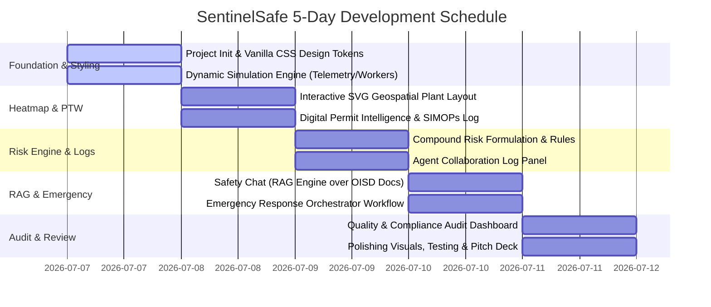

# 🛡️ SentinelSafe: AI-Powered Industrial Safety Intelligence for Zero-Harm Operations

SentinelSafe is a next-generation, AI-driven **Industrial Safety Intelligence (ISI) platform** designed to eliminate fatal workplace accidents in heavy industries (steel, chemical, mining, and manufacturing). By bridging the gap between isolated safety tools, SentinelSafe fuses real-time IoT sensor telemetry, digital Work Permits (PTW), worker geolocation, and regulatory compliance into a unified intelligence layer that predicts and prevents accidents before they occur.

---

## 📌 About the Project

### The Problem Context
India's heavy industrial sector continues to pay a devastating human cost. According to **DGFASLI**, over **6,500 fatal workplace accidents** were recorded in FY2023 alone (excluding most mining and construction sectors). In January 2025, eight workers tragically died at the Visakhapatnam Steel Plant when entrapped gases triggered a sudden explosion in the coke oven battery. This facility had fully functional gas detectors, permit-to-work protocols, and SCADA systems. However, warning signals existed on isolated dashboards and were **unacted upon** because there was no intelligence layer to correlate gas pressure sensor spikes with active hot-work permits in the vicinity. 

A **FICCI survey in 2024** revealed that **over 60% of large industrial facilities** rely on manual handoffs to coordinate between their own digital safety tools. The bottleneck is not a lack of safety systems; it is the **absence of a unified intelligence layer** that translates disjointed data points into preemptive, life-saving operational decisions.

### Our Solution
**SentinelSafe** addresses this critical vulnerability by acting as the plant's digital central nervous system. It continuously ingests streams from:
1. **IoT / SCADA Telemetry**: Gas concentrations (CO, CH4, O2), temperature, and pressure.
2. **Digital Permit to Work (PTW)**: Details, locations, and timings of active maintenance, hot work, and confined space entries.
3. **Geospatial Worker Badges**: Live locations of field workers and maintenance crews.
4. **Shift Logs & Historical Incident Files**: Regulatory standards (OISD, Factory Act) and past near-miss records.

By correlating these inputs, the platform's multi-agent risk engine detects **compound risk conditions**—such as active hot work permits in zones experiencing sub-critical gas accumulation—and triggers immediate emergency response protocols or automatic permit suspensions.

---

## 🏗️ System Architecture

SentinelSafe operates using a decentralized multi-agent system where specialized agents monitor individual safety vectors, collaborate to identify compound risks, and output real-time alerts.

---

## 🚀 Core Features

### 1. Compound Risk Detection Engine
Correlates disparate data points in real time to detect high-risk configurations that single-sensor baselines miss. 
* *Example:* It will not flag a 10ppm CO reading alone, nor an active hot work permit alone, but will immediately raise a **Critical Alert** if both occur in the same coke oven zone simultaneously.

### 2. Geospatial Safety Heatmap
An interactive, high-fidelity 2D plant layout SVG showing dynamic hazard indexes (Safe, Warning, Critical) across key plant structures, detailing active permits, active workers, and real-time gas/sensor overlays.

### 3. Digital Permit Intelligence Agent
Monitors active permits against live plant telemetry. Automatically identifies **Simultaneous Operations (SIMOPs)** conflicts (e.g., hot work authorized near active gas venting lines) and suggests permit suspensions.

### 4. Incident Pattern Intelligence (RAG Chat)
An interactive AI assistant pre-loaded with regulatory documentation (Factory Act 1948, OISD-137, OISD-105) and historical incident profiles. It allows safety officers to ask questions and receive structured guidance with direct regulatory citations.

### 5. Emergency Response Orchestrator
When a critical compound risk is triggered, this module handles the first 10 minutes of crisis: activates plant-wide alarms, displays an evacuation tracker, triggers shut-off valves, alerts first responders, and generates a preliminary regulatory incident report.

### 6. Quality & Compliance Audit Agent
Monitors shift changeovers, pre-work safety check logs, and training records. Calculates a real-time compliance score and automatically generates corrective actions for procedural deviations.

---

## 🛠️ Tech Stack

* **Frontend**: React (Vite), JavaScript (ES6+)
* **Styling**: Vanilla CSS (Custom properties, grid systems, glassmorphism, responsive grids, and neon-alert glow variables)
* **Visualization**: Interactive SVG layouts, Recharts for sensor history graphs
* **Agent Simulation**: Stateful react-context engine simulating collaborative multi-agent decisions (debates, telemetry, location movements)
* **Icons**: `lucide-react`

---

## 📅 5-Day Implementation Timeline

---

## 🏷️ Tags

`#IndustrialSafety` `#AIAgents` `#GeospatialAnalytics` `#MultiAgentSystems` `#ZeroHarm` `#RAG` `#RiskIntelligence` `#FactoryAct` `#OISD` `#SCADADetector`
