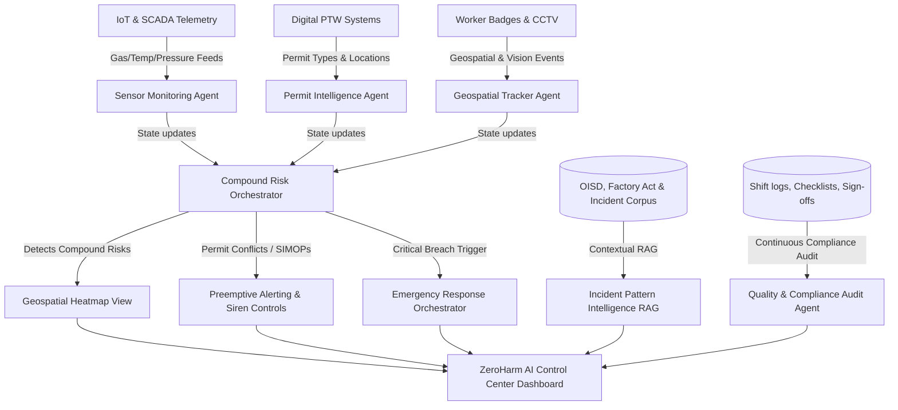

# 🛡️ ZeroHarm AI: AI-Powered Industrial Safety Intelligence for Zero-Harm Operations

[](#)
[](#)
[](#)
[](#)

`#IndustrialSafety` `#AIAgents` `#GeospatialAnalytics` `#MultiAgentSystems` `#ZeroHarmAI` `#RAG` `#RiskIntelligence` `#FactoriesAct` `#OISD` `#SCADA` `#ComputerVision` `#ProcessGraphs`

ZeroHarm AI is a next-generation, AI-driven **Industrial Safety Intelligence (ISI) platform** designed to eliminate fatal workplace accidents in heavy industries (steel, chemical, mining, and manufacturing). By bridging the gap between isolated safety tools, ZeroHarm AI fuses real-time IoT sensor telemetry, digital Work Permits (PTW), worker geolocation, CCTV computer vision alerts, plant topology, and regulatory compliance into a unified intelligence layer that predicts and prevents accidents before they occur.

---

## 👥 Collaborators

- [Parinamika-13](https://github.com/Parinamika-13)
- [SSJ-08](https://github.com/SSJ-08)
- [vahinichilukamarri](https://github.com/vahinichilukamarri)
- [AnishaPaturi](https://github.com/AnishaPaturi)

---

## 📌 About the Project

### The Problem Context
India's heavy industrial sector continues to pay a devastating human cost. According to **DGFASLI**, over **6,500 fatal workplace accidents** were recorded in FY2023 alone (excluding most mining and construction sectors). In January 2025, eight workers tragically died at the Visakhapatnam Steel Plant when entrapped gases triggered a sudden explosion in the coke oven battery. This facility had fully functional gas detectors, permit-to-work protocols, and SCADA systems. However, warning signals existed on isolated dashboards and were **unacted upon** because there was no intelligence layer to correlate gas pressure sensor spikes with active hot-work permits in the vicinity. 

A **FICCI survey in 2024** revealed that **over 60% of large industrial facilities** rely on manual handoffs to coordinate between their own digital safety tools. The bottleneck is not a lack of safety systems; it is the **absence of a unified intelligence layer** that translates disjointed data points into preemptive, life-saving operational decisions.

### Our Solution
**ZeroHarm AI** addresses this critical vulnerability by acting as the plant's digital central nervous system. It continuously ingests streams from:
1. **IoT / SCADA Telemetry**: Gas concentrations (CO, CH4, O2), temperature, and pressure.
2. **Digital Permit to Work (PTW)**: Details, locations, and timings of active maintenance, hot work, and confined space entries.
3. **Geospatial Worker Badges**: Live locations of field workers and maintenance crews.
4. **CCTV/CV Analytics**: Detections of safety infractions (PPE violations) or physical hazards (smoke, unauthorized access).
5. **Shift Logs & Historical Incident Files**: Regulatory standards (OISD, Factory Act) and past near-miss records.

By correlating these inputs, the platform's multi-agent risk engine detects **compound risk conditions**—such as active hot work permits in zones experiencing sub-critical gas accumulation—and triggers immediate emergency response protocols or automatic permit suspensions.

---

## 🏗️ System Architecture

ZeroHarm AI operates using a decentralized multi-agent system where specialized agents monitor individual safety vectors, collaborate to identify compound risks, and output real-time alerts.



---

## 🚀 Core & Advanced Features

### 1. Compound Risk Detection Engine
Correlates disparate data points in real time to detect high-risk configurations that single-sensor baselines miss. 
* *Example:* It will not flag a 10ppm CO reading alone, nor an active hot work permit alone, but will immediately raise a **Critical Alert** if both occur in the same coke oven zone simultaneously.

### 2. Geospatial Safety Heatmap
An interactive, high-fidelity 2D plant layout SVG showing dynamic hazard indexes (Safe, Warning, Critical) across key plant structures, detailing active permits, active workers, and real-time gas/sensor overlays.

### 3. Digital Permit Intelligence Agent
Monitors active permits against live plant telemetry. Automatically identifies **Simultaneous Operations (SIMOPs)** conflicts (e.g., hot work authorized near active gas venting lines) and suggests permit suspensions.

### 4. Incident Pattern Intelligence (RAG Chat)
An interactive AI assistant pre-loaded with regulatory documentation (Factory Act 1948, OISD-137, OISD-105) and historical incident profiles. It allows safety officers to ask questions and receive structured guidance with direct regulatory citations.

### 5. Emergency Response Orchestrator
When a critical compound risk is triggered, this module handles the first 10 minutes of crisis: activates plant-wide alarms, displays an evacuation tracker, triggers shut-off valves, alerts first responders, and generates a preliminary regulatory incident report.

### 6. Quality & Compliance Audit Agent
Monitors shift changeovers, pre-work safety check logs, and training records. Calculates a real-time compliance score and automatically generates corrective actions for procedural deviations.

### 7. CCTV Computer Vision AI Telemetry
Integrates physical visual sensors directly into the safety logic. Ingests CCTV analytics event logs (e.g., lack of safety helmets/harnesses, smoke/sparks, or unauthorized entry into dangerous zones) and escalates local hazard indices instantly.

### 8. Plant Process Graph & Topology Cascading Risk
Uses a directed in-memory process graph (`networkx`) representing pipelines, valves, vents, and units to trace and propagate cascading hazards. Instead of calculating spherical buffers, it models how toxic leaks or fire spreads through process connections.

### 9. Temporal Rate-of-Change Tracking
Maintains a rolling historical buffer of sensor readings to compute the velocity and acceleration of gas accumulation (e.g., $d[CO]/dt$). This allows the platform to raise early warnings before static thresholds are officially breached.

### 10. Actionable Compliance & Safety Workflows (Ticketing)
Translates audit gaps and incident findings into trackable safety tickets assigned to specific roles (e.g., "Maintenance Engineer"). Safety officers can update, audit, and sign off on tasks to close the safety loop.

### 11. Black Box Evidence Preservation ("Flight Data Recorder")
Upon a critical incident trigger, the system automatically captures and seals the preceding 10 minutes of raw telemetry, active permits, worker tracks, and agent deliberations. This is written into a read-only JSON archive file under `backend/data/evidence/` to prevent tampering.

### 12. Dynamic RAG Document Ingestion & Upload
Enables safety teams to upload new regulatory policies, shift logs, or standard operating procedures directly into the RAG vector search index. Uploaded files are dynamically parsed, chunked, and vectorized on the fly.

### 13. Serialized ML Model Persistence
Maintains supervised Random Forest and unsupervised Isolation Forest anomaly scoring models. Features automated pickle/joblib serialization to disk, preventing delays and retrains during server reboot cycles.

### 14. Gatehouse Onboarding System (Tiered Trust Model)
Enforces a secure, multi-stage trust clearance system for safety personnel in compliance with Factories Act Sec. 87. Prevents public domain signups (gmail/yahoo/etc.), collects statutory safety certificates, and routes registration requests to a "pending sponsorship" queue visible to verified plant administrators.

---

## 💡 Innovation Pipeline (20x AI Features)

Beyond the core platform, ZeroHarm AI is architected to integrate the following 20 high-impact AI innovations that industrial operators demand:

### Innovation 1: Explainable AI Risk Reasoning
Instead of a black-box percentage, the system breaks down every risk score into human-readable factors with confidence levels.

**Example:**
- **Reason 1:** Gas level rising — Confidence: 95%
- **Reason 2:** Hot work permit nearby — Confidence: 91%
- **Reason 3:** Maintenance overdue — Confidence: 84%
- **Reason 4:** Similar accident occurred in 2022 — Confidence: 88%
- **Final Risk:** 92%

Industrial companies love explainability because it turns AI anxiety into actionable trust.

### Innovation 2: Near Miss Prediction
Instead of waiting for accidents, the system predicts near misses by analyzing behavioral and environmental patterns.

**Example:**
- Worker repeatedly entering restricted area
- ↓
- Nothing happened today
- ↓
- **System predicts:** High probability of incident within next shift.

### Innovation 3: AI Safety Coach
Every worker gets a Personal Safety Score based on behavioral history, with AI-driven recommendations.

**Example — Worker A:**
- Forgot PPE 3 times
- Entered restricted zone twice
- Ignored alert once
- Fatigue score high
- **Safety Score:** 62/100
- **AI recommends:** Mandatory PPE training, No night shift, Assign supervisor

Personalized safety at the individual level.

### Innovation 4: Dynamic Risk Graph (Knowledge Graph)
Instead of independent databases, build a connected Knowledge Graph:

```
Worker → Working On → Machine → Located In → Zone → Gas Sensor → Permit → Supervisor → Maintenance → Historical Accident
```

Now AI can reason: *"Machine A is connected to Valve B inside Zone C where Gas D is increasing."* This is far smarter than SQL joins.

### Innovation 5: AI Root Cause Generator
After an incident, AI automatically generates a structured root cause analysis:

- **Primary Cause:** Gas accumulation
- **Secondary Cause:** Valve maintenance delay
- **Contributing Cause:** Poor ventilation
- **Human Factor:** Permit approved despite warning
- **Regulation Violated:** OISD 117 Section 8.2
- **Corrective Action:** Replace valve, Install sensor, Retrain operator

No manual investigation required.

### Innovation 6: Risk Propagation Engine
One equipment failure affects many. AI predicts cascading domino effects:

```
Valve Failure → Pressure Increase → Gas Leak → Boiler Shutdown → Power Loss → Emergency Ventilation Failure → Entire Unit Shutdown
```

Think of it as domino prediction across the entire plant.

### Innovation 7: Fatigue Detection
Using CCTV face analysis, shift logs, and attendance data, the system predicts worker fatigue before it becomes an accident. Research shows fatigue causes many industrial accidents.

### Innovation 8: AI Shift Handover Summary
Shift changes are major causes of accidents. Instead of handwritten notes, AI generates a structured shift summary:

- **Equipment Offline:** Boiler 2
- **Gas Alert:** Zone C
- **Permit Active:** Tank 14
- **Maintenance:** Valve Replacement
- **High Risk:** Confined Space Entry
- **Recommendations:** Continue ventilation

Next shift understands instantly.

### Innovation 9: Regulatory Copilot
Instead of searching PDFs manually, safety officers ask natural language questions:

> "Can hot work happen here?"

AI answers with exact regulatory citations:

- **Factory Act** — Section ...
- **OISD 117** — Clause ...
- **Required PPE:** ...
- **Fire Watch:** Yes/No
- **Gas Test:** Required
- **Isolation Required:** Yes/No
- **Permit Needed:** Yes

Like ChatGPT for industrial regulations.

### Innovation 10: Autonomous Emergency Commander
Not just an alert — the system automatically executes emergency response:

```
Explosion Detected → Stop conveyor → Close gas valve → Open emergency vents → Call fire station → Notify hospital → SMS workers → Generate evacuation route → Mark missing workers → Create incident report
```

An AI incident commander that acts in seconds, not minutes.

### Innovation 11: Spatial AI
Instead of reading isolated sensor values, AI understands location relationships:

> Gas sensor → 3m away → Worker → 8m away → Hot work → 2m away → Gas cylinder

Spatial reasoning gives far more accurate risk assessment than point-in-time sensor thresholds.

### Innovation 12: Learning Risk Memory
Every day, the system learns plant-specific patterns:

- **Monday Morning:** High risk
- **Rain:** Gas accumulation
- **Night Shift:** Valve failures
- **Summer:** Cooling failures
- **Maintenance Fridays:** Higher accident probability

Eventually predicts accidents based on patterns unique to that plant.

### Innovation 13: Autonomous Drone Inspection
When AI detects risk, a drone automatically:

- Flies to location
- Streams video
- Checks leak
- Thermal imaging
- Gas concentration
- Worker count

Instead of sending humans into danger first.

### Innovation 14: Natural Language Query Engine
Safety officers ask in plain English:

> "Show me all confined space permits where gas exceeded 20 ppm during maintenance in the last six months."

AI returns:
- Charts
- Heatmap
- Incidents
- Recommendations

No SQL required.

### Innovation 15: Risk Memory using RAG + Knowledge Graph
Instead of retrieving similar reports, AI reasons across multiple dimensions:

```
Current Event → Similar Incident → Equipment Similarity → Weather Similarity → Maintenance Similarity → Root Cause Similarity → Recommended Prevention
```

This is much richer than standard RAG.

### Innovation 16: Plant Safety GPT
Chat interface for safety decisions:

> "Can I approve this permit?"

AI answers:

> **No**
> **Reason:**
> - Gas 18ppm
> - Maintenance ongoing
> - Electrical isolation incomplete
> - Worker missing certification
> **Recommendation:** Reject permit.

### Innovation 17: Self-Improving AI Agents
Agents evaluate each other's decisions and update confidence based on outcomes:

```
Risk Agent → Permit Agent disagrees → CV Agent confirms → Supervisor Feedback → Agents update confidence
```

Continuous learning without changing core rules.

### Innovation 18: Predictive Maintenance Integration
AI correlates sensor degradation patterns with maintenance schedules to predict equipment failures before they cause safety incidents.

### Innovation 19: Digital Twin Simulation
A living digital twin of the plant that runs "what-if" scenarios in real time, allowing safety officers to simulate incidents and test response protocols without real-world risk.

### Innovation 20: Cross-Plant Intelligence
Anonymized safety patterns from multiple plants are aggregated to improve prediction accuracy for all facilities, creating a federated learning network for industrial safety.

---

## 📂 Complete Workspace Folder Structure

Below is the complete file and directory layout of the ZeroHarm AI project workspace:

```
📂 ET-Hackathon (Workspace Root)
 ├── 📄 ABOUT.md                       # Executive summary & judging criteria alignment
 ├── 📄 README.md                      # Core project documentation & setup instructions
 ├── 📄 gap.md                         # Product gap analysis & engineering suggestions
 ├── 📄 backend_testing_methodologies.md # Detailed testing guidelines for backend APIs
 ├── 📄 openapi_testing_guide.md       # Guide for testing with OpenAPI specs
 ├── 📄 logo.png                       # ZeroHarm AI logo image
 ├── 📄 package.json                   # Root package configuration for Next.js app
 ├── 📄 package-lock.json              # NPM package lock
 ├── 📂 backend                        # FastAPI backend application
 │    ├── 📄 .env                      # Environment configurations (API keys, ports)
 │    ├── 📄 requirements.txt          # Python dependency manifest
 │    ├── 📄 run.py                    # Server startup script
 │    ├── 📄 run_all_tests.py          # Unified test execution suite
 │    ├── 📄 test_api.py               # Test Client A: Core Risk rules & ML anomaly models
 │    ├── 📄 test_api_b.py             # Test Client B: Heatmap & evacuations
 │    ├── 📄 test_api_c.py             # Test Client C: RAG & compliance audits
 │    ├── 📄 test_api_d.py             # Test Client D: Permit intelligence & integration assessments
 │    ├── 📄 test_cctv.py              # Test: Computer Vision alerts & PPE violations
 │    ├── 📄 test_temporal.py          # Test: Temporal telemetry trends (rate of change)
 │    ├── 📄 test_topology.py          # Test: Process network topology risk propagation
 │    ├── 📄 test_blackbox.py          # Test: Black box flight data logging verification
 │    ├── 📂 data
 │    │    └── 📂 evidence             # Incident telemetry archive (tamper-proof black box blocks)
 │    └── 📂 app
 │         ├── 📄 __init__.py
 │         ├── 📄 config.py            # Global configuration (zones, thresholds)
 │         ├── 📄 main.py              # FastAPI application server entrypoint
 │         ├── 📂 engine               # Person A: Safety Rules Engine & ML Models
 │         │    ├── 📄 ml_anomaly.py   # Isolation Forest and Random Forest classifiers
 │         │    ├── 📄 models.py       # Risk scoring data structures (Pydantic schemas)
 │         │    ├── 📄 rules.py        # Statutory safety rule calculations (OISD, Factories Act)
 │         │    ├── 📄 if_model.pkl    # Serialized Isolation Forest model
 │         │    └── 📄 rf_model.pkl    # Serialized Random Forest model
 │         ├── 📂 geospatial           # Person B: Plant Layout & Spatial Computation
 │         │    ├── 📄 heatmap.py      # Spatial risk computation & hazard mapping
 │         │    ├── 📄 models.py       # Geolocation Pydantic schemas
 │         │    ├── 📄 plant_layout.py # 2D plant coordinates config
 │         │    ├── 📄 topology.py     # Process Graph (cascading risk propagation)
 │         │    └── 📄 worker_simulator.py # Live worker coordinate simulator
 │         ├── 📂 orchestrator         # Person B: Emergency Dispatch & Actions
 │         │    ├── 📄 alert_channels.py # Dispatch alerts to dashboards, sirens, SMS
 │         │    ├── 📄 evacuation.py   # Safe exit route calculations, speed tracking
 │         │    ├── 📄 incident_report.py # Automated regulatory incident report builder
 │         │    └── 📄 workflow.py     # Actionable safety task workflows (ticketing system)
 │         ├── 📂 permits              # Person D: Digital Permit Intelligence Agent
 │         │    ├── 📄 agent.py        # Permit intelligence compliance checks
 │         │    ├── 📄 models.py       # Permit schema definitions
 │         │    └── 📄 rules.py        # Permit conflict checks (SIMOPs detection)
 │         ├── 📂 rag                  # Person C: Incident RAG Agent
 │         │    ├── 📄 agent.py        # LLM integration (OpenRouter) & local fallback
 │         │    ├── 📄 documents.py    # Statutory reference manuals & incident logs database
 │         │    └── 📄 vector_store.py # Local search index (TF-IDF and dynamic document indexer)
 │         └── 📂 integration          # Person D: Core Integration Pipeline
 │              ├── 📄 demo_script.py  # Simulation walk-through demo script
 │              ├── 📄 models.py       # Unified assessment schemas
 │              └── 📄 pipeline.py     # Multi-agent orchestrator aggregating Person A/B/C/D states
 └── 📂 frontend                       # Next.js UI Dashboard
      ├── 📄 package.json              # Frontend package script configurations
      ├── 📄 package-lock.json         # Frontend package locks
      ├── 📄 next.config.ts            # Next.js configurations
      ├── 📄 postcss.config.js         # CSS compiler settings
      ├── 📄 tailwind.config.ts        # UI component themes & color layouts
      ├── 📄 tsconfig.json             # Typescript configurations
      ├── 📂 public                    # Static media files & logo graphic assets
      ├── 📂 styles
      │    └── 📄 globals.css          # CSS styles & glassmorphism/glow custom variables
      ├── 📂 types
      │    ├── 📄 analytics.ts         # Chart data type definitions
      │    ├── 📄 incident.ts          # Incident report type structures
      │    └── 📄 user.ts              # Authorization type structures
      ├── 📂 hooks
      │    ├── 📄 useAuth.ts           # Login verification & cookie session manager
      │    ├── 📄 useIncident.ts       # Query and submit incidents & workflows
      │    └── 📄 useNotifications.ts  # WebSockets state notifications hook
      ├── 📂 services
      │    ├── 📄 api.ts               # Axios interceptors config
      │    ├── 📄 agents.ts            # Fetches agent state
      │    ├── 📄 analytics.ts         # Handles chart data requests
      │    ├── 📄 auth.ts              # Connects authorization APIs
      │    ├── 📄 chatbot.ts           # Handles RAG assistant queries
      │    ├── 📄 decisionEngine.ts    # Risk evaluation & ML endpoint calls
      │    ├── 📄 incident.ts          # Retrieves and updates incidents & tickets
      │    └── 📄 scenarioEngine.ts    # Control simulator triggers
      ├── 📂 component
      │    ├── 📄 AIChat.tsx           # RAG chatbot prompt input interface
      │    ├── 📄 AIResultCard.tsx     # Chat output container displaying source citations
      │    ├── 📄 AnalyticsChart.tsx   # Visualizes sensor trends with threshold limits
      │    ├── 📄 Button.tsx           # Custom styled buttons
      │    ├── 📄 ComplianceCard.tsx   # Displays audit violations with rule citations
      │    ├── 📄 DashboardCard.tsx    # Unified card container
      │    ├── 📄 Footer.tsx           # Dashboard footer bar
      │    ├── 📄 IncidentForm.tsx     # Custom permit requests & manual reporting console
      │    ├── 📄 IncidentTable.tsx    # List of generated incidents & black box downloads
      │    ├── 📄 Loader.tsx           # Animated page loaders & loaders
      │    ├── 📄 Modal.tsx            # Overlay popups
      │    ├── 📄 Navbar.tsx           # Navigation bar with active alarm sirens
      │    ├── 📄 NotificationPanel.tsx # Notifications dropdown showing active alerts
      │    ├── 📄 RiskGauge.tsx        # Gauge dial visualizing composite risk score
      │    ├── 📄 ScenarioConsole.tsx  # Dynamic dashboard console to trigger simulator ticks
      │    ├── 📄 Sidebar.tsx          # Sidebar menu
      │    ├── 📄 StatCard.tsx         # Real-time indicators of single sensors (green/amber/red)
      │    ├── 📄 Timeline.tsx         # Evacuation path steps
      │    └── 📄 UploadBox.tsx        # File drag-and-drop document upload block
      └── 📂 app
           ├── 📄 layout.tsx           # Next.js global layout & styling setup
           ├── 📄 page.tsx             # Landing overview page
           ├── 📄 not-found.tsx        # Standard 404 page
           ├── 📂 login
           │    └── 📄 page.tsx        # Sign-in portal page
           ├── 📂 signup
           │    └── 📄 page.tsx        # Multi-step safety officer onboarding request wizard
           ├── 📂 admin
           │    └── 📄 page.tsx        # Gatehouse onboarding & sponsorship approval queue
           ├── 📂 dashboard
           │    └── 📄 page.tsx        # Core control center dashboard
           ├── 📂 analysis
           │    └── 📄 page.tsx        # Detailed risk indicators & ML scoring
           ├── 📂 analytics
           │    └── 📄 page.tsx        # Time-series telemetry tracking dashboard
           ├── 📂 chatbot
           │    └── 📄 page.tsx        # Incident Pattern Intelligence chat portal
           ├── 📂 compliance
           │    └── 📄 page.tsx        # Real-time OISD/Factories Act compliance audit console
           ├── 📂 incidents
           │    └── 📄 page.tsx        # Incident logger page with flight recorder exports
           ├── 📂 reports
           │    └── 📄 page.tsx        # Regulatory report compiler
           ├── 📂 settings
           │    └── 📄 page.tsx        # Camera config, simulated ticks, & model configuration
           └── 📂 profile
                └── 📄 page.tsx        # Operational profile page
```

---

## 🛠️ Code Reference Links

Easily navigate to key implementation files in the project workspace:
* Rules Engine Evaluator: [backend/app/engine/rules.py]
* Process Topology Cascading Logic: [backend/app/geospatial/topology.py]
* ML Anomaly Detection Model: [backend/app/engine/ml_anomaly.py]
* RAG Search Agent: [backend/app/rag/agent.py]
* Permit Intelligence Agent: [backend/app/permits/agent.py]
* Integration Orchestrator Pipeline: [backend/app/integration/pipeline.py]
* Actionable Ticket Workflows: [backend/app/orchestrator/workflow.py]

---

## 🛡️ ZeroHarm AI Execution Guide

### 🚀 1. Running the Backend Server

#### virtualenv Activation
Ensure your Python virtual environment is activated and dependencies are installed.

**PowerShell:**
```powershell
.\.venv\Scripts\Activate.ps1
```

**Command Prompt / CMD:**
```cmd
.venv\Scripts\activate.bat
```

#### Run FastAPI
From the workspace root directory:
```bash
python backend/run.py
```
This runs the API server on **`http://127.0.0.1:8000`**. The interactive Swagger UI documentation is accessible at [http://localhost:8000/docs](http://localhost:8000/docs).

---

### 🚀 2. Running the Full Stack (Frontend + Backend)

From the workspace root, you can start both the Next.js frontend and FastAPI backend with a single command:

```bash
npm run dev:full
```

This uses `concurrently` to run:
- **Frontend**: Next.js dev server on `http://localhost:3000`
- **Backend**: FastAPI server on `http://localhost:8000`

Alternatively, run them in separate terminals:

**Terminal 1 (Backend):**
```bash
npm run backend
# or: python backend/run.py
```

**Terminal 2 (Frontend):**
```bash
npm run dev
# or: cd frontend && npm run dev
```

---

### 🧪 3. Executing the Test Suites

ZeroHarm AI includes a comprehensive, automated testing suite covering rules engines, evacuations, RAG, and advanced telemetry integrations:

| Script | Purpose / Testing Area | Command |
| :--- | :--- | :--- |
| **All Tests Runner** | Run all tests in sequence | `python backend/run_all_tests.py` |
| **Test Client A** | Risk engine calculations & Random Forest/Isolation Forest anomalies | `python backend/test_api.py` |
| **Test Client B** | SVG heatmaps, live worker logs, and evacuation dispatching | `python backend/test_api_b.py` |
| **Test Client C** | OpenRouter/Local Fallback RAG questions and compliance audits | `python backend/test_api_c.py` |
| **Test Client D** | Permit overlaps, SIMOPs calculations, and multi-agent aggregate state | `python backend/test_api_d.py` |
| **CCTV Test** | Video analytics event ingestion (PPE violations) & safety scoring | `python backend/test_cctv.py` |
| **Temporal Test** | Roll buffer gas concentration speed ($d[CO]/dt$) and warnings | `python backend/test_temporal.py` |
| **Topology Test** | Network adjacency process loops cascading risk calculation | `python backend/test_topology.py` |
| **Black Box Test** | Automatic telemetry flight logs serialization check | `python backend/test_blackbox.py` |

---

## 📊 Scenario Inputs & Expected Outputs

Here are the precise inputs submitted to the backend and what the safety engine outputs for each scenario.

### Scenario 1: Clean/Normal Operations
* **Zone**: `Blast Furnace A`
* **Telemetry**: Standard atmospheric readings (20.8% O2, low CO, 0% Methane).
* **Permits**: None.

#### Input Data (`POST /risk-score`)
```json
{
  "zone": "Blast Furnace A",
  "gas_readings": {
    "o2": 20.8,
    "co": 2.0,
    "ch4_lfl": 0.0,
    "h2s": 0.1,
    "temperature": 28.0,
    "pressure": 1.0
  },
  "permits": [],
  "maintenance_active": false,
  "shift_changeover_active": false,
  "timestamp": "2026-07-16T12:00:00Z"
}
```

#### Expected Output
```json
{
  "zone": "Blast Furnace A",
  "composite_risk_score": 6.0,
  "risk_level": "Safe",
  "rule_score": 5.0,
  "ml_score": 7.6,
  "action_required": "ROUTINE MONITORING - Standard operating procedures apply. No corrective action needed.",
  "suspend_permits": [],
  "factors": [
    {
      "name": "Normal Operations (Clean Telemetry)",
      "score": 5.0,
      "contribution": 100.0,
      "details": "No active hazardous permits, no maintenance, and all sensors reporting green."
    }
  ]
}
```

---

### Scenario 2: Methane Leak during Hot Work (Explosion Hazard)
* **Zone**: `Coke Oven Battery 1`
* **Telemetry**: Methane is elevated at **6.8% LFL** (above the 4% safety limit for spark-producing work).
* **Permits**: Active hot work permit (`PTW-HW-202`).

#### Input Data (`POST /risk-score`)
```json
{
  "zone": "Coke Oven Battery 1",
  "gas_readings": {
    "o2": 20.8,
    "co": 5.0,
    "ch4_lfl": 6.8,
    "h2s": 0.1,
    "temperature": 32.5,
    "pressure": 1.02
  },
  "permits": [{
    "permit_id": "PTW-HW-202",
    "permit_type": "hot_work",
    "status": "active",
    "zone": "Coke Oven Battery 1",
    "workers_count": 3
  }],
  "maintenance_active": false,
  "shift_changeover_active": false,
  "timestamp": "2026-07-16T12:00:00Z"
}
```

#### Expected Output
```json
{
  "zone": "Coke Oven Battery 1",
  "composite_risk_score": 95.0,
  "risk_level": "Critical",
  "rule_score": 95.0,
  "ml_score": 64.7,
  "action_required": "EVACUATE AREA & HALT PERMITS - Composite risk score is critical. Safety sirens should be activated. Emergency Response Orchestrator must coordinate evacuation.",
  "suspend_permits": ["PTW-HW-202"],
  "factors": [
    {
      "name": "Explosion Hazard (CH4 Flammability)",
      "score": 34.4,
      "contribution": 26.6,
      "details": "FLAMMABLE GAS DETECTED: Methane level is 6.8% LFL (Lower Flammable Limit). Explosion risk elevated."
    },
    {
      "name": "Hot Work Flammable Gas Overlap",
      "score": 95.0,
      "contribution": 73.4,
      "details": "CRITICAL: Active Hot Work (ignition source) in area with 6.8% LFL Methane. High risk of immediate fire/explosion. Violation of OISD-STD-105 Work Permit standards."
    }
  ]
}
```

---

### Scenario 3: Oxygen Depletion in Confined Space (Asphyxiation Hazard)
* **Zone**: `Sinter Plant`
* **Telemetry**: Oxygen dropped to **16.2%** (critical asphyxiation range < 19.5% per Factories Act Sec 36) and CO elevated to **28 ppm**.
* **Permits**: Confined space entry permit active (`PTW-CS-101`).

#### Input Data (`POST /risk-score`)
```json
{
  "zone": "Sinter Plant",
  "gas_readings": {
    "o2": 16.2,
    "co": 28.0,
    "ch4_lfl": 0.1,
    "h2s": 0.2,
    "temperature": 29.0,
    "pressure": 0.98
  },
  "permits": [{
    "permit_id": "PTW-CS-101",
    "permit_type": "confined_space",
    "status": "active",
    "zone": "Sinter Plant",
    "workers_count": 2
  }],
  "maintenance_active": false,
  "shift_changeover_active": false,
  "timestamp": "2026-07-16T12:00:00Z"
}
```

#### Expected Output
```json
{
  "zone": "Sinter Plant",
  "composite_risk_score": 92.0,
  "risk_level": "Critical",
  "rule_score": 92.0,
  "action_required": "EVACUATE AREA & HALT PERMITS - Composite risk score is critical. Safety sirens should be activated. Emergency Response Orchestrator must coordinate evacuation.",
  "suspend_permits": ["PTW-CS-101"],
  "factors": [
    {
      "name": "Asphyxiation Risk (Oxygen Deficiency)",
      "score": 89.5,
      "details": "ASPHYXIATION HAZARD: Oxygen level is critical at 16.2% (below 19.5% standard threshold, Factories Act Sec 36)."
    },
    {
      "name": "Confined Space Compound Risk",
      "score": 92.0,
      "details": "CRITICAL: Active Confined Space permit overlapping with abnormal gas readings. Poor ventilation in confined spaces creates lethal hazard traps (Factories Act 1948 Section 36 compliance breach)."
    }
  ]
}
```

---

### Scenario 4: SIMOPs Permit Clash (Simultaneous Operations Conflict)
* **Zone**: `Coke Oven Battery 1`
* **Telemetry**: Clean gas readings.
* **Permits**: Both **Hot Work** and **Confined Space** entry are active in the same zone at the same time.

#### Input Data (`POST /risk-score`)
```json
{
  "zone": "Coke Oven Battery 1",
  "gas_readings": {
    "o2": 20.8,
    "co": 3.0,
    "ch4_lfl": 0.2,
    "h2s": 0.1,
    "temperature": 30.0,
    "pressure": 1.0
  },
  "permits": [
    { "permit_id": "PTW-HW-202", "permit_type": "hot_work", "status": "active", "zone": "Coke Oven Battery 1" },
    { "permit_id": "PTW-CS-303", "permit_type": "confined_space", "status": "active", "zone": "Coke Oven Battery 1" }
  ],
  "maintenance_active": false,
  "shift_changeover_active": false,
  "timestamp": "2026-07-16T12:00:00Z"
}
```

#### Expected Output
```json
{
  "zone": "Coke Oven Battery 1",
  "composite_risk_score": 80.0,
  "risk_level": "Critical",
  "factors": [
    {
      "name": "SIMOPs (Simultaneous Operations) Hazard",
      "score": 15.0,
      "details": "SIMOPs Conflict: Hot Work (ignition) and Confined Space (toxic hazard) active simultaneously..."
    }
  ]
}
```

---

## 🏛️ Covered Statutory Frameworks

ZeroHarm AI directly references and audits compliance against:
* **The Factories Act, 1948 (Section 36)**: Confined space entry checks (ventilation requirements, O2 levels, and rescue gear).
* **OISD-GDN-137**: Guidelines on hazardous gas monitoring systems and sensor placements.
* **OISD-STD-105**: Work Permit System standards (Hot work, Cold work, Confined space, and Height work constraints).
* **DGMS (Directorate General of Mines Safety)**: Heavy equipment and hazardous area safety rules.

