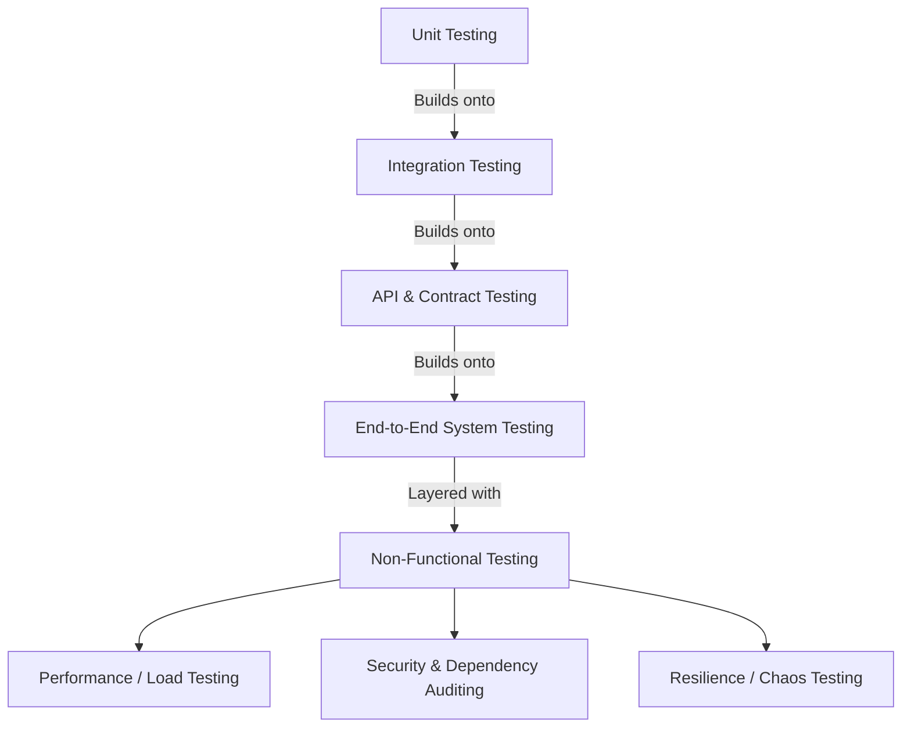

# 🛡️ Guide to Backend Testing Methodologies

Testing a backend application involves verifying that logic is correct, system integrations function seamlessly, data structures conform to API specifications, performance is stable under load, and the system is secure.

This document outlines **all major backend testing methodologies**, provides concrete examples using the Python / FastAPI ecosystem, and maps how they apply to the **ZeroHarm AI Industrial Safety Intelligence Platform** codebase.

---

## 📊 1. The Backend Testing Hierarchy

In modern software engineering, backend testing is structured as a hierarchy, moving from fast, isolated tests to comprehensive, system-wide checks.



---

## 🔍 2. Deep-Dive into Testing Methodologies

### 1. Unit Testing
* **Definition**: Testing the smallest testable parts of an application (individual functions, utility classes, model validation constraints) in complete isolation.
* **Scope**: No network calls, no databases, no filesystem access. Everything external is mocked.
* **Implementation in Python**: Using `pytest` or `unittest`.
* **ZeroHarm AI Context**: Verifying that gas threshold mathematical formulas or risk contribution computations evaluate correctly.
* **Example**:
  ```python
  # unit_test.py
  def calculate_co_risk(co_ppm):
      if co_ppm >= 50:
          return 90.0
      elif co_ppm >= 25:
          return 50.0
      return 0.0

  def test_calculate_co_risk():
      assert calculate_co_risk(60) == 90.0
      assert calculate_co_risk(30) == 50.0
      assert calculate_co_risk(10) == 0.0
  ```

---

### 2. Integration Testing
* **Definition**: Verifying that two or more modules, services, or databases interact correctly.
* **Scope**: May write to test databases, read local mock files, or call multiple functions in sequence.
* **Implementation in Python**: Using `pytest` alongside FastAPI’s in-process `TestClient` (built on Starlette) to bypass the network socket while calling HTTP endpoints.
* **ZeroHarm AI Context**: Testing if a database tick stores telemetry in history and if that history is retrieved correctly during an incident evaluation.
* **Example**:
  ```python
  # test_integration.py
  from fastapi.testclient import TestClient
  from app.main import app

  client = TestClient(app)

  def test_get_plant_layout():
      response = client.get("/api/plant-layout")
      assert response.status_code == 200
      data = response.json()
      assert "Blast Furnace A" in data
      assert data["Blast Furnace A"]["hazard_classification"] == "high"
  ```

---

### 3. API & Blackbox Functional Testing
* **Definition**: Testing the system from the outside via its API endpoints without knowing or relying on the internal code structures.
* **Scope**: Real HTTP requests sent to a running server over network sockets. State changes are verified through sequential endpoint calls.
* **Implementation**: `requests` or `urllib` in Python, Postman collections.
* **ZeroHarm AI Context**: Your current test suite (`test_api.py`, `test_blackbox.py`) does this. It launches requests to a running `run.py` server to simulate telemetry updates and verify returned actions.

---

### 4. Contract & OpenAPI Testing
* **Definition**: Testing that the API requests and responses strictly adhere to the contract schema (schemas, headers, data types, status codes) defined in the OpenAPI specification.
* **Scope**: Reading the auto-generated `/openapi.json` and asserting schemas against client/server behavior.
* **Tools**: Schemathesis, Dredd.
* **ZeroHarm AI Context**: Running property-based tests via Schemathesis to fuzz the `/risk-score` endpoint to check for contract deviations or server crashes (`5xx` errors).

---

### 5. Performance, Load & Stress Testing
* **Definition**: Evaluating the system's speed, responsiveness, stability, and resource usage under simulated concurrent user traffic.
* **Scope**:
  - **Load Testing**: Verifying behavior under expected normal user loads.
  - **Stress Testing**: Pushing the API beyond its limits to find breaking points.
  - **Spike Testing**: Verifying reaction to sudden surges in requests.
* **Tools**: **Locust** (Python-based), **k6** (Javascript), Apache JMeter.
* **ZeroHarm AI Context**: Simulating thousands of concurrent telemetry ticks from IoT sensors on various plant zones.
* **Example (Locustfile)**:
  ```python
  # locustfile.py
  from locust import HttpUser, task, between

  class SafetyPlatformUser(HttpUser):
      wait_time = between(0.5, 2.0)

      @task
      def get_heatmap(self):
          self.client.get("/api/heatmap")

      @task
      def send_telemetry(self):
          self.client.post("/risk-score", json={
              "zone": "Blast Furnace A",
              "gas_readings": {"o2": 20.8, "co": 2.0, "ch4_lfl": 0.0, "h2s": 0.1, "temperature": 28.0, "pressure": 1.0},
              "permits": [],
              "maintenance_active": False,
              "shift_changeover_active": False
          })
  ```

---

### 6. Security Testing
* **Definition**: Auditing the application code, dependencies, and deployment structure for vulnerabilities.
* **Scope**:
  - **SAST (Static Application Security Testing)**: Scanning the codebase for security flaws (e.g. hardcoded secrets, dangerous functions).
  - **SCA (Software Composition Analysis)**: Scanning packages in `requirements.txt` for known vulnerabilities.
  - **DAST (Dynamic Application Security Testing)**: Running fuzzing and exploit attempts against active API endpoints.
* **Tools**: Bandit (for Python SAST), `pip-audit` / Safety (SCA), OWASP ZAP (DAST).
* **ZeroHarm AI Context**: Scanning Python files for SQL Injection hazards, unencrypted secrets in `.env`, or outdated, vulnerable libraries.

---

### 7. Resilience & Chaos Testing
* **Definition**: Intentionally injecting faults (network latency, database disconnects, third-party service outages) to ensure the system degrades gracefully.
* **Scope**: Simulating server environments.
* **ZeroHarm AI Context**: Verifying that the incident RAG engine defaults to local TF-IDF processing when Google's Generative AI API is offline or rate-limiting requests.

---

## 🗺️ 3. How Your Existing Tests Map to This Guide

The `backend` directory contains several excellent test clients. Here is how they align with backend testing methodologies:

| Test Script | Testing Methodology | What it Validates |
| :--- | :--- | :--- |
| **[test_topology.py](file:///C:/Users/anish/OneDrive/College/Hackathon/ET-Hackathon/backend/test_topology.py)** | **Integration Testing** | Checks the cascading hazard topology models and networkx graph logic. |
| **[test_temporal.py](file:///C:/Users/anish/OneDrive/College/Hackathon/ET-Hackathon/backend/test_temporal.py)** | **Integration Testing** | Checks gas drift over time and rate-of-change logic. |
| **[test_cctv.py](file:///C:/Users/anish/OneDrive/College/Hackathon/ET-Hackathon/backend/test_cctv.py)** | **Integration / API Testing** | Verifies CCTV feeds, threat alerts, and automated workflow triggers. |
| **[test_api.py](file:///C:/Users/anish/OneDrive/College/Hackathon/ET-Hackathon/backend/test_api.py)** | **API Blackbox Testing** | Tests composite risk calculations across multiple scenarios (Methane leaks, SIMOPs). |
| **[test_api_b.py](file:///C:/Users/anish/OneDrive/College/Hackathon/ET-Hackathon/backend/test_api_b.py)** | **Integration & API Testing** | Tests geospatial map color updates, evacuations, and simulation loops. |
| **[test_api_c.py](file:///C:/Users/anish/OneDrive/College/Hackathon/ET-Hackathon/backend/test_api_c.py)** | **Integration & API Testing** | Validates the RAG retrieval mechanism, documents registry, and statutory compliance checks. |
| **[test_api_d.py](file:///C:/Users/anish/OneDrive/College/Hackathon/ET-Hackathon/backend/test_api_d.py)** | **Integration & API Testing** | Audits work permit rules, conflict tracking, and unified full-assessment aggregation. |
| **[test_blackbox.py](file:///C:/Users/anish/OneDrive/College/Hackathon/ET-Hackathon/backend/test_blackbox.py)** | **End-to-End State Integration** | Validates black-box data logging, read-only file lock preservation, and history sealing. |

---

## 🚀 4. Recommended Testing Roadmap for ZeroHarm AI

To round out your backend test suite and implement a world-class API validation pipeline:

1. **Add a pytest-driven Unit/Integration Suite**:
   Move from stand-alone scripts that rely on a manually running server (`python run.py`) to an automated in-process test suite run with `pytest` using FastAPI's `TestClient`.
2. **Incorporate Contract Linting (Schemathesis)**:
   Add a contract testing step to your build pipeline. Running `schemathesis run http://127.0.0.1:8000/openapi.json` will automatically find unhandled errors without manual input code writing.
3. **Execute Dependency Audits**:
   Ensure code dependencies are safe by running `pip-audit` to inspect `requirements.txt` for security gaps.
4. **Conduct Load Profiling**:
   Use **Locust** to test how FastAPI and your Pandas/NetworkX models handle high-frequency sensor streams under simultaneous requests.
