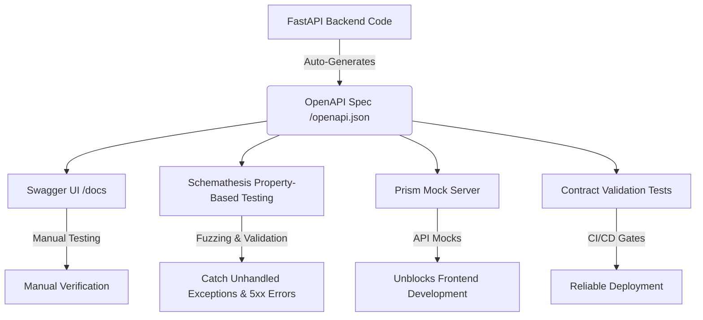

# 🛡️ OpenAPI-Driven Backend Testing Guide

This guide provides a comprehensive overview of how to test the **ZeroHarm AI Industrial Safety Intelligence Platform** backend (and FastAPI/OpenAPI-based backends in general) using OpenAPI specifications. 

Using OpenAPI for backend testing ensures that your API contracts are strictly enforced, helps identify unhandled edge cases, automates the generation of test payloads, and simplifies frontend-backend integration.

---

## 📊 1. The OpenAPI-Driven Testing Lifecycle

By leveraging the auto-generated OpenAPI schema from FastAPI (served at `/openapi.json`), you can automate several testing phases without writing redundant test cases manually.



---

## 🛠️ 2. OpenAPI Generation in FastAPI

FastAPI automatically parses your Pydantic models, path parameters, and query parameters to generate a fully compliant OpenAPI 3.0 specification. 

### How to Retrieve the OpenAPI Schema
1. **Start the server locally**:
   ```bash
   python backend/run.py
   ```
2. **Access the raw JSON schema**:
   Open [http://localhost:8000/openapi.json](http://localhost:8000/openapi.json) in your browser, or download it via `curl`/`Invoke-WebRequest`:
   ```powershell
   Invoke-WebRequest -Uri "http://localhost:8000/openapi.json" -OutFile "backend/openapi.json"
   ```

---

## 🧪 3. Three Pillars of OpenAPI Backend Testing

### 1. Manual & Interactive Testing (Swagger UI)
FastAPI integrates **Swagger UI** out-of-the-box, serving interactive documentation at:
👉 **[http://localhost:8000/docs](http://localhost:8000/docs)**

> [!TIP]
> Use Swagger UI during development to visually verify query parameters, headers, and request bodies for endpoints such as `POST /risk-score` and `POST /api/compliance/audit`. You can click **"Try it out"**, fill in the JSON data, and inspect the response codes and headers directly.

---

### 2. Autonomous Contract & Fuzz Testing (Schemathesis)
**Schemathesis** is a property-based testing tool that reads the OpenAPI schema and automatically generates thousands of test cases (inputs) to attempt to break your endpoints. It verifies:
* **Contract conformance**: Does the server response match the schema defined in the OpenAPI spec?
* **Resilience**: Does the server crash (return `500 Internal Server Error`) when sent edge-case inputs (e.g., negative numbers, empty arrays, extreme strings)?

#### Setting Up Schemathesis
Install Schemathesis in your virtual environment:
```bash
pip install schemathesis
```

#### Running Schemathesis against the Backend
Ensure the FastAPI backend is running on `http://127.0.0.1:8000`, then execute:
```bash
schemathesis run http://127.0.0.1:8000/openapi.json
```

To focus Schemathesis on specific endpoints (e.g., only `/risk-score`):
```bash
schemathesis run --endpoint "/risk-score" http://127.0.0.1:8000/openapi.json
```

> [!NOTE]
> **Expected Output**: Schemathesis will print a test run showing which endpoints passed and failed. A fail indicates that either a response did not match the defined JSON schema (e.g., a field was missing) or the server returned an unhandled `5xx` status code.

---

### 3. API Mocking for Frontend & Integration (Prism)
When developing the frontend or running integration tests in parallel, you don't need to boot up the entire backend database, ML pipelines, and RAG index. **Prism** reads your `openapi.json` and spins up a local mock server.

#### Running Prism Mock Server
1. Download the OpenAPI spec from `http://127.0.0.1:8000/openapi.json` to a local file `openapi.json`.
2. Run Prism via `npx`:
   ```bash
   npx -y @stoplight/prism-cli mock openapi.json -p 4010
   ```
3. Point your frontend or integration tests to `http://localhost:4010`. Prism will automatically return mock responses matching the types and formats defined in your schema.

---

## 📝 4. Writing OpenAPI Contract Validation Tests in Python

In addition to autonomous tools, you can write unit/integration tests that validate response payloads against the OpenAPI specification. This ensures that any change in backend code does not accidentally break the contract expected by clients.

Below is an example of an integration test using `pytest`, `requests`, and `jsonschema` to validate that the backend's `/risk-score` endpoint strictly conforms to the OpenAPI specification.

### Integration Test Example (`backend/test_contract.py`)
```python
import requests
import json
from jsonschema import validate, RefResolver

# 1. Base URL of the running API
BASE_URL = "http://127.0.0.1:8000"

def test_risk_score_contract_conformance():
    # Step A: Retrieve the live OpenAPI schema
    schema_response = requests.get(f"{BASE_URL}/openapi.json")
    assert schema_response.status_code == 200, "Failed to retrieve OpenAPI schema"
    openapi_spec = schema_response.json()
    
    # Step B: Extract the response schema definition for POST /risk-score -> 200 OK
    # Note: OpenAPI 3.0 references are resolved via the components section
    components = openapi_spec.get("components", {})
    risk_response_schema = components.get("schemas", {}).get("RiskCheckResponse")
    
    assert risk_response_schema is not None, "RiskCheckResponse schema not found in OpenAPI spec"
    
    # Step C: Prepare test payload (Scenario 2: Hot Work + Methane Leak)
    test_payload = {
        "zone": "Coke Oven Battery 1",
        "gas_readings": {
            "o2": 20.8,
            "co": 5.0,
            "ch4_lfl": 6.8,
            "h2s": 0.1,
            "temperature": 32.5,
            "pressure": 1.02
        },
        "permits": [{
            "permit_id": "PTW-HW-202",
            "permit_type": "hot_work",
            "status": "active",
            "zone": "Coke Oven Battery 1",
            "workers_count": 3
        }],
        "maintenance_active": False,
        "shift_changeover_active": False,
        "timestamp": "2026-07-16T12:00:00Z"
    }
    
    # Step D: Execute the API call
    response = requests.post(f"{BASE_URL}/risk-score", json=test_payload)
    assert response.status_code == 200, f"API call failed with status: {response.status_code}"
    
    response_data = response.json()
    
    # Step E: Validate response body against the OpenAPI schema
    # Use RefResolver to resolve any $ref pointers pointing to components/schemas in the spec
    resolver = RefResolver.from_schema(openapi_spec)
    
    try:
        validate(instance=response_data, schema=risk_response_schema, resolver=resolver)
        print("Contract validation SUCCESS: Response matches OpenAPI schema perfectly!")
    except Exception as err:
        raise AssertionError(f"Contract validation FAILED: {err}")

if __name__ == "__main__":
    print("Running Contract Conformance Test...")
    test_risk_score_contract_conformance()
```

---

## ⚖️ 5. Comparison of OpenAPI Testing Tools

| Tool | Testing Type | Best For | Pros | Cons |
| :--- | :--- | :--- | :--- | :--- |
| **Swagger UI** | Manual / Interactive | Ad-hoc testing, exploration | Visually intuitive, built-in | Not automatable, manual |
| **Schemathesis** | Automated / Property-based | Catching server crashes, schema mismatches | Generates edge cases, zero-config | Can be slow on large specs, high logs |
| **Dredd** | Automated / Contract | Validating document-implementation sync | Strict validation of responses | Rigid setup, requires setup of mock server state |
| **Prism** | Mocking | Frontend / Client isolation testing | Fast, lightweight, instant validation | Mock data is random unless configured |
| **Postman / Newman**| Automated / Integration | Orchestrated integration test flows | Great UI, shares collections easily | Manual collection maintenance |

---

## 🏆 6. Best Practices for OpenAPI Backend Testing

> [!IMPORTANT]
> To maximize the effectiveness of OpenAPI testing, follow these best practices:

1. **Keep Schemas Updated**: Ensure any changes in Pydantic models or endpoint routes are immediately reflected in your schema. Since FastAPI does this dynamically, you only need to ensure the server is restarted before running schema tests.
2. **Fail CI/CD on 500 Errors**: Integrate `schemathesis` or `dredd` into your deployment pipeline. Configure them to fail the build if a `5xx` error code is returned. This catches boundary exceptions (e.g., divide-by-zero, unhandled `NoneType` errors) before hitting production.
3. **Use Pydantic Constraints**: Define fields in Pydantic with strict constraints (e.g., `Field(..., ge=0, le=100)` for percentage fields like O2 or relative flammability). This instructs the OpenAPI generator to document these ranges, and testing tools will use these bounds, reducing false-positive errors on inputs that the schema should reject as `422 Unprocessable Entity`.
4. **Assert JSON Headers**: Make sure all endpoints return `Content-Type: application/json`. Testing tools flag missing or wrong headers as schema violations.

---

### Running the Live Tests
To execute your current backend integration test clients, navigate to the `backend/` folder and run:
```bash
# Terminal 1: Run server
python backend/run.py

# Terminal 2: Run clients
python backend/test_api.py
python backend/test_api_b.py
python backend/test_api_c.py
python backend/test_api_d.py
```
